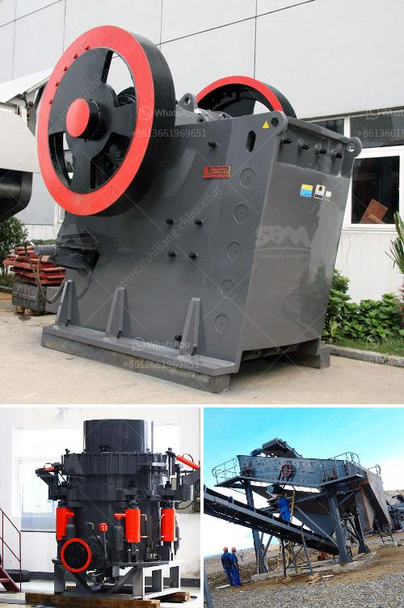

<h3>rejection coal mills with double seal</h3>
In today's energy landscape, the drive towards sustainability and efficiency has necessitated innovative solutions within the coal industry. Coal grinding mills, crucial components in coal-fired power generation, play a significant role in pulverizing coal into fine particles for combustion. Rejecting coal mills with double seal technology have emerged as a game-changer, presenting several advantages that contribute to increased efficiency, reduced emissions, and improved safety.

The primary function of a coal mill is to grind raw coal to a controlled particle size, maximizing its combustion efficiency. One key advantage of rejection coal mills with double seal technology is their ability to deliver a more consistent particle size distribution. The double seal system prevents leakage and prohibits coal dust ingress, ensuring that the desired grind is achieved. This consistent particle size distribution leads to improved combustion efficiency resulting in greater energy output from the same amount of coal.

One of the most pressing challenges presented by coal-fired power plants is managing emissions, specifically fine particulate matter. Rejection coal mills with double seal technology offer an effective solution in mitigating the release of fine coal dust, which is a common source of air pollution. The double seal system significantly minimizes coal dust leakage, preventing its dispersion into the surrounding environment. This enhanced control over emissions contributes to cleaner air quality and a more sustainable energy production process.

Safety considerations hold paramount importance across all industries, and the coal sector is no exception. Traditional coal mills operate with a single seal, significantly increasing the risk of coal dust explosions or fires due to inadequate containment. In contrast, rejection coal mills with double seal technology employ a secondary seal as a safety measure, providing an additional protective barrier against coal dust leakage. This double-layered seal system acts as a safeguard, reducing the risk of hazardous incidents and subsequent damage to personnel and infrastructure.

In addition to enhancing safety, the double seal system also simplifies the maintenance process of coal mills. The presence of two seals enables a strategic approach, allowing for maintenance of one seal while the mill continues operation using the other. This eliminates the need for complete shutdowns, reducing downtime, and enabling more efficient maintenance activities. Additionally, the prevention of coal dust ingress into the mill's inner components extends the lifespan of critical equipment, ultimately reducing maintenance costs.

Rejecting coal mills with double seal technology offer an array of benefits, revolutionizing the efficiency, safety, and sustainability of coal grinding processes. By achieving a more consistent particle size distribution, these mills optimize combustion efficiency and maximize energy output. The double seal system greatly reduces emissions and mitigates environmental impact by preventing coal dust leakage. Moreover, this technology ensures operational safety, decreasing the risk of hazardous incidents and safeguarding personnel and infrastructure. Finally, the simplified maintenance process and extended equipment life provided by double seal coal mills contribute to cost savings in the long run. With these advantages, the adoption of rejection coal mills with double seal technology paves the way for a greener, safer, and more efficient future in the coal industry.
<h3>Contact us</h3><ul><li><strong>Whatsapp:&nbsp;<a href="https://wa.me/8613661969651">+8613661969651</a></strong></li><li><a href="https://swt.shibang-china.com/?git&amp;zhl&amp;rejection coal mills with double seal"><strong>Online Service(chat now)</strong></a></li></ul><h3>Related</h3><ul><li><a href='decibels generated by hebro jaw crusher.md'>decibels generated by hebro jaw crusher</a></li><li><a href='compact vibrating ball mill manufactures.md'>compact vibrating ball mill manufactures</a></li><li><a href='impact crusher specification limestone.md'>impact crusher specification limestone</a></li><li><a href='cement plant operations handbook.md'>cement plant operations handbook</a></li><li><a href='hammer mills for sand.md'>hammer mills for sand</a></li></ul>