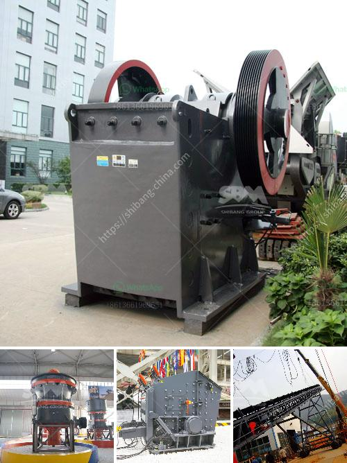

<h3>rental crusher vertical</h3>
In the dynamic world of construction, there is often a need for crushing equipment that can quickly and efficiently break down various materials such as concrete, asphalt, and rocks. However, not all construction projects require a permanent crusher installation. This is where rental crusher vertical comes into play, offering builders and contractors a flexible and cost-effective solution.

A rental crusher vertical is a specially designed machine that allows for on-site crushing of materials. Unlike traditional crushers that require a foundation and substantial setup time, these machines can be easily transported to the construction site and set up within minutes. This portability feature makes them ideal for projects that require crushing in multiple locations.

One of the key advantages of a rental crusher vertical is its versatility. These machines are equipped with powerful jaws and advanced hydraulic systems, enabling them to handle a wide range of materials. Whether it's demolishing concrete structures, crushing rocks for road construction, or recycling asphalt, a rental crusher vertical can efficiently process the job at hand.

Another benefit of using a rental crusher vertical is the cost-effectiveness it offers. Instead of investing in a permanent installation, builders and contractors can choose to rent these machines for the duration of their project. This eliminates the need for ongoing maintenance and storage costs, making it an economical choice for short-term crushing needs.

Moreover, rental crusher verticals are well-maintained and regularly inspected, ensuring optimal performance and safety. Rental companies also provide skilled operators who are trained in handling the equipment efficiently. This gives builders and contractors peace of mind, knowing that the crushing process will be carried out by professionals.

In conclusion, rental crusher verticals are a game-changer in the construction industry. They provide the flexibility and convenience of on-site crushing without the commitment of a permanent installation. With their versatility, cost-effectiveness, and reliable performance, these machines are the ultimate solution for builders and contractors looking to optimize their construction projects.
<h3>Contact us</h3><ul><li><strong>Whatsapp:&nbsp;<a href="https://wa.me/8613661969651">+8613661969651</a></strong></li><li><a href="https://swt.shibang-china.com/?git&amp;zhl&amp;rental crusher vertical"><strong>Online Service(chat now)</strong></a></li></ul><h3>Related</h3><ul><li><a href='iron ore crushing equipment in mexico.md'>iron ore crushing equipment in mexico</a></li><li><a href='price of stone crusher machine in nigeria.md'>price of stone crusher machine in nigeria</a></li><li><a href='used portable crushing plant philippines.md'>used portable crushing plant philippines</a></li><li><a href='ore crushing machine.md'>ore crushing machine</a></li><li><a href='grinding mill tecator cyclotec.md'>grinding mill tecator cyclotec</a></li></ul>