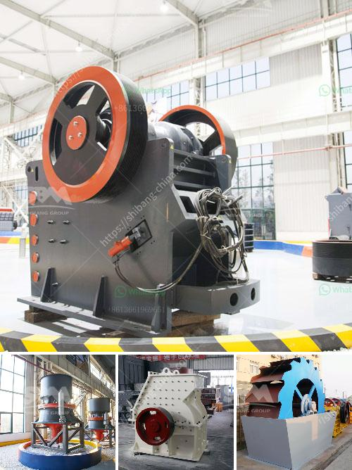

<h3>river stone crusher plant for sale in india</h3>
Stone crushing plant is the main equipment in mining industry. It consists of the vibrating feeder, jaw crusher, cone crusher, impact crusher, vibrating screen and belt conveyors. It is widely used in the industry of mining, metallurgy, building materials, traffic, water conservancy and so on. With the rapid development of industry, more and more investors are joining the stone crushing business. In India, there are many stone crusher plants for sale with different types of crushers, such as jaw crusher, cone crusher, impact crusher, hammer crusher and mobile crusher.

The footprints of plants are often seen near rivers. The reason is that rivers provide an abundant source of stones for construction. Therefore, river stone crusher plant is often used in India. To help you make the most out of your investment, we provide high-efficiency stone crushing plants that are durable and cost-effective. Our river stone crusher plants can produce the pebbles, sand, and gravel stones for construction purposes. The primary crushing equipment is the jaw crusher, which is ideally suitable for primary crushing. The material is evenly conveyed to the jaw crusher through the vibrating feeder, and the crushed stone is further crushed by the belt conveyor to produce the final product.

In addition to the jaw crusher, we also provide cone crusher, impact crusher, hammer crusher, and mobile crusher for your choice. The cone crusher is suitable for secondary crushing, and the impact crusher is used for tertiary crushing. The hammer crusher is mainly used for fine crushing, and the mobile crusher can be used as a complete crushing plant. With the mobile crusher, you can quickly adjust the production capacity according to your requirements.

There are several factors that you should consider when choosing a stone crusher plant for sale in India. First of all, you should consider the properties of the stones to be crushed. Different stones have different hardness and abrasiveness, so you need to choose the appropriate crusher accordingly. Secondly, you should consider the production capacity of the plant. The production capacity should match your production requirement, otherwise, you may encounter production problems. Thirdly, you should consider the operational cost. A high-efficiency stone crusher plant can save your cost significantly. Lastly, you should also consider the after-sales service. A reliable after-sales service can help you solve any problems that may occur during the operation of the plant.

Overall, river stone crusher plant for sale in India is a perfect combination of crushing technology and production efficiency. The plant not only has beautiful shape and appearance, but also has high performance and high-quality materials. Whether you are a stone mine owner or a construction company, there will be suitable crushers and complete stone crushing plants for your choice. We are committed to providing you with the best products and services. Welcome to visit our website and contact us for more information about our river stone crusher plants.
<h3>Contact us</h3><ul><li><strong>Whatsapp:&nbsp;<a href="https://wa.me/8613661969651">+8613661969651</a></strong></li><li><a href="https://swt.shibang-china.com/?git&amp;zhl&amp;river stone crusher plant for sale in india"><strong>Online Service(chat now)</strong></a></li></ul><h3>Related</h3><ul><li><a href='granite quarrying companies.md'>granite quarrying companies</a></li><li><a href='stone crusher manufacturers in ludhiana.md'>stone crusher manufacturers in ludhiana</a></li><li><a href='mobile crusher parker 50th crusher for sale.md'>mobile crusher parker 50th crusher for sale</a></li><li><a href='two prefabricated concrete production line.md'>two prefabricated concrete production line</a></li><li><a href='slag crusher makers in india.md'>slag crusher makers in india</a></li></ul>