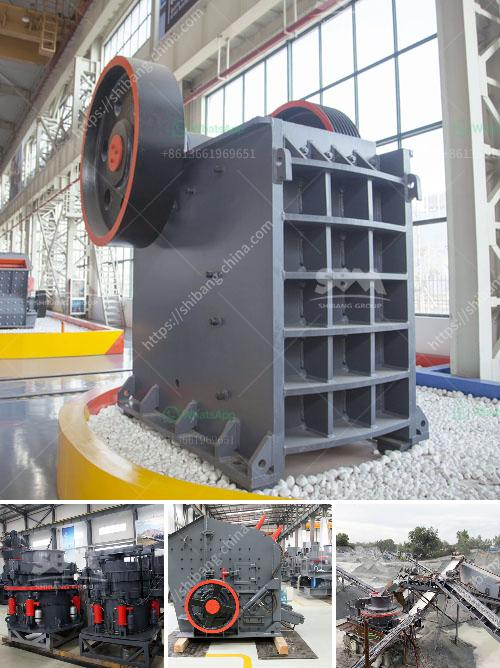

<h3>robo sand making equipment rates in india</h3>
Robo sand, as an alternative to river sand, is gaining traction in the construction industry in India. With the growing concern over the depletion of river sand resources and the increase in illegal sand mining activities, the use of robo sand has become a popular choice. This artificial sand is manufactured by crushing granite and other hard rocks, which are abundantly available in various parts of India.

The demand for robo sand is on the rise due to its superior quality and numerous advantages compared to river sand. Firstly, robo sand has a consistent particle size distribution, making it an excellent choice for construction purposes. It provides better workability and requires less water for mixing, enabling faster construction. Moreover, robo sand is free from organic and impurity content, reducing the chances of efflorescence and other structural issues.

To meet the growing demand for robo sand in India, several companies have started manufacturing machinery solely dedicated to producing robo sand. These machines are designed to produce sand that meets the required specifications and standards for various applications in the construction industry. The machinery used for robo sand making includes jaw crushers, impact crushers, cone crushers, VSI crushers, and vibrating screens.

Jaw crushers are primarily used to crush large size rocks into small particles. These crushers have a fixed jaw and a movable jaw, which exert pressure on the rocks to break them into smaller pieces. Impact crushers, on the other hand, utilize the principle of impact to crush the rocks. They have a rotor that spins rapidly and strikes the rocks, producing high-speed impact forces. This type of crushing mechanism is particularly efficient for producing robo sand of a specific shape.

Cone crushers, commonly used in the secondary and tertiary stages of the crushing process, are perfect for producing robo sand with a uniform particle size distribution. These crushers have a cone-shaped crushing chamber that allows the rocks to be crushed between the mantle and concave. VSI crushers, also known as vertical shaft impact crushers, are specifically designed to produce high-quality sand from hard and abrasive rocks like granite. The rocks are crushed by throwing them against a high-speed rotor, which results in excellent shaping and particle size reduction.

In addition to these crushers, vibrating screens are an essential piece of equipment for robo sand manufacturing. They are used to separate the crushed stones into different sizes and eliminate any unwanted particles. Vibrating screens play a crucial role in ensuring that the final product meets the required specifications for different applications, such as concrete production, plastering, and brickwork.

The rates of robo sand making equipment in India may vary based on the specific requirements and capabilities of different machines. Factors such as the capacity, the feed size, the product size, the power consumption, and the maintenance and operational costs influence the prices of these machines. Additionally, the location and proximity to raw material sources can also impact the rates.

In conclusion, robo sand making equipment is essential for the production of high-quality robo sand in India. With the increasing demand for this artificial sand, more and more companies are investing in the manufacturing of machinery dedicated to robo sand production. These machines, including crushers and vibrating screens, ensure the production of uniform and superior quality robo sand, contributing to sustainable and efficient construction practices.
<h3>Contact us</h3><ul><li><strong>Whatsapp:&nbsp;<a href="https://wa.me/8613661969651">+8613661969651</a></strong></li><li><a href="https://swt.shibang-china.com/?git&amp;zhl&amp;robo sand making equipment rates in india"><strong>Online Service(chat now)</strong></a></li></ul><h3>Related</h3><ul><li><a href='quartz plant and machinary.md'>quartz plant and machinary</a></li><li><a href='mineral industrial crusher.md'>mineral industrial crusher</a></li><li><a href='jaw crusher in dubai.md'>jaw crusher in dubai</a></li><li><a href='stone crushing plants.md'>stone crushing plants</a></li><li><a href='mobile crusher hire in south africa.md'>mobile crusher hire in south africa</a></li></ul>