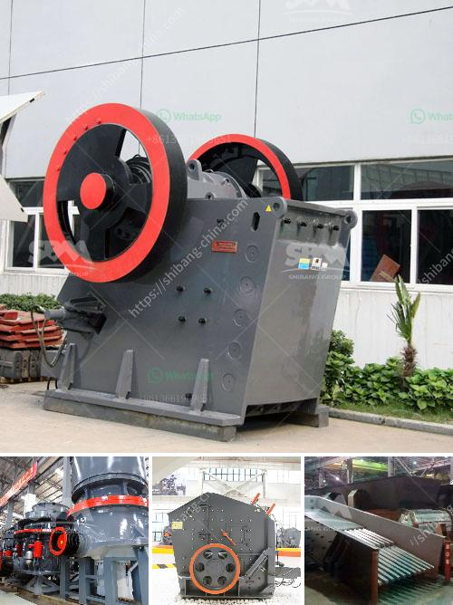

<h3>rock crasher for sale philippines</h3>
When it comes to improving your construction efficiency and productivity, nothing beats the versatility of a rock crusher for sale Philippines. In recent years, the Philippine government has embarked on an infrastructure development program that aims to accelerate the country's economic growth. With the increasing number of construction projects, there is a growing demand for heavy equipment such as rock crushers.

A rock crusher is a device used to crush rocks into smaller pieces, usually for gravel or some other road or building application. Most rock crushers have a hopper at the top -- a container which holds the rock above the crusher and uses gravity to feed it in. Alternately, rock crushers can use a belt drive to continuously transport the rock into the crusher.

At the heart of every rock crusher is a cone crusher, a type of compression crusher that provides a reduction ratio between 4:1 and 6:1. This means that when the feed material is dumped into the crusher, the particles are crushed between a stationary and moving piece of steel. The result is a finely crushed and well-shaped final product.

One of the primary advantages of using a rock crusher is its versatility. It can be used for a variety of applications, including road construction, concrete recycling, and mining operations. Whether you need to crush rocks into different sizes for building materials or break down large pieces of rock into smaller aggregates, a rock crusher is the perfect solution.

In the Philippines, there are many options for customers to choose from, including jaw crushers, cone crushers, and impact crushers. With each type of crusher, there are different models, so you can choose the one that best suits your needs. There are also portable rock crusher machines that can be easily moved and installed at the construction site.

Rock crushers are indispensable equipment in the construction and mining industries. They help break down large pieces of ore into smaller, more manageable sizes for further processing or transportation. Investing in a rock crusher is crucial to ensuring that you can complete your projects on time and within budget.

When looking for a rock crusher for sale Philippines, you should have many options. You can find different models and sizes at local suppliers or online stores. Some even offer customizations so you can get exactly what you need. It is important to do your research and compare prices before making a purchase.

In conclusion, a rock crusher is an invaluable tool when it comes to construction and mining projects. It offers versatility, efficiency, and convenience, making it a must-have equipment in your arsenal. Whether you are working on a small-scale project or a large-scale construction site, investing in a rock crusher can greatly improve your productivity and help you achieve your goals. So, don't hesitate to explore the options available and find the right rock crusher for sale Philippines today.
<h3>Contact us</h3><ul><li><strong>Whatsapp:&nbsp;<a href="https://wa.me/8613661969651">+8613661969651</a></strong></li><li><a href="https://swt.shibang-china.com/?git&amp;zhl&amp;rock crasher for sale philippines"><strong>Online Service(chat now)</strong></a></li></ul><h3>Related</h3><ul><li><a href='quotation for stone crusher.md'>quotation for stone crusher</a></li><li><a href='industrial mills for coal.md'>industrial mills for coal</a></li><li><a href='industrial gypsum rotary kiln.md'>industrial gypsum rotary kiln</a></li><li><a href='cone crusher 100tph prices in india.md'>cone crusher 100tph prices in india</a></li><li><a href='controlling parameter of impact crusher.md'>controlling parameter of impact crusher</a></li></ul>