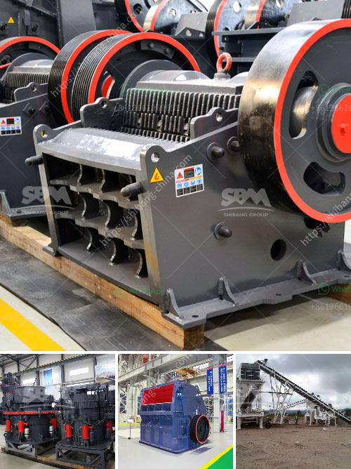

<h3>rock crusher design</h3>
A rock crusher is not just a machine that crushes rocks. It is a vital piece of equipment that is used for many different applications. The rock crusher design concept focuses on the essentials, giving attention to reducing the size and weight of the machine without compromising performance. This means that rock crushers are constructed with high-strength materials to withstand the intense forces exerted during the crushing process.

One of the primary considerations in rock crusher design is the size of the intended end product. Ideally, a rock crusher will have a high reduction ratio. This means that it can efficiently reduce the size of the material to the desired product size while minimizing the generation of fines. The reduction ratio is determined by the gap between the crusher jaws or cones and the size of the input material.

Another important aspect of rock crusher design is the energy consumption. A rock crusher that consumes less power will allow the operator to save on energy costs while maintaining top performance. To achieve energy efficiency, a rock crusher should feature a high-efficiency motor or engine, as well as an advanced drive system. Additionally, the design should optimize the mechanical advantage of the crusher to maximize its crushing force without increasing the power requirements.

Durability is another critical consideration in rock crusher design. Since crushing rocks can subject the machine to extreme forces and wear, it is crucial to use high-strength materials and advanced manufacturing techniques. This ensures that the rock crusher can withstand the demands of the application without premature failure.

The ease of maintenance is also an essential factor to consider in the design of a rock crusher. Accessible and well-placed inspection and maintenance points can significantly reduce downtime and maintenance costs. Furthermore, the design should allow for quick and straightforward replacement of wear parts, such as the crusher jaws or impact bars.

Safety is paramount in any equipment design, especially in the case of rock crushers, which involve powerful mechanical forces. Proper guarding and safety features should be implemented to protect operators from potential hazards. Additionally, adequate noise and dust suppression should be addressed to provide a safe and comfortable working environment.

In conclusion, the design of a rock crusher aims to optimize multiple factors to meet the specific requirements of crushing applications. These factors include reduction ratio, energy consumption, durability, ease of maintenance, safety, and environmental impact. By considering these factors, engineers can develop rock crushers that deliver efficient and reliable performance while minimizing the overall operational costs.

When selecting a rock crusher for a specific application, it is crucial to consult with experts who understand the specific requirements and challenges in the intended use. By working closely with professionals, operators can ensure they choose the right rock crusher design that will maximize productivity, reduce downtime, and ultimately yield the desired end product.
<h3>Contact us</h3><ul><li><strong>Whatsapp:&nbsp;<a href="https://wa.me/8613661969651">+8613661969651</a></strong></li><li><a href="https://swt.shibang-china.com/?git&amp;zhl&amp;rock crusher design"><strong>Online Service(chat now)</strong></a></li></ul><h3>Related</h3><ul><li><a href='companies that manufacture ball mill.md'>companies that manufacture ball mill</a></li><li><a href='vertical grinding machine for marble.md'>vertical grinding machine for marble</a></li><li><a href='iron ore crushing process.md'>iron ore crushing process</a></li><li><a href='used mobile crushing plant trailer.md'>used mobile crushing plant trailer</a></li><li><a href='how to start stone crusher project.md'>how to start stone crusher project</a></li></ul>