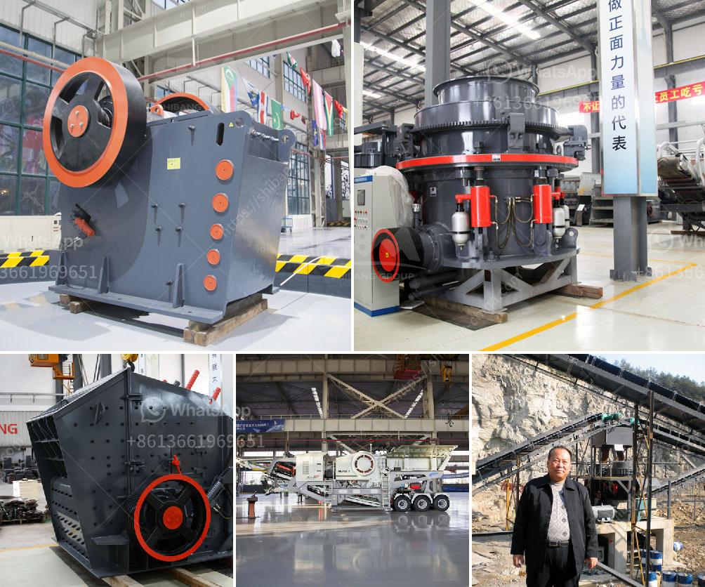

<h3>rock crusher mercadolibre</h3>
In today's fast-paced construction industry, the need for efficient and reliable crushing equipment is paramount. Contractors and project managers are constantly searching for cutting-edge solutions to maximize productivity and ensure the success of their projects. One platform that has gained immense popularity among users is Rock Crusher Mercadolibre – a trusted online marketplace offering a wide range of top-notch rock crushers.

Rock Crusher Mercadolibre, part of the renowned MercadoLibre family, has emerged as a go-to platform for individuals and businesses looking to purchase high-quality rock crushing equipment. With a vast inventory of crushers from reputable manufacturers, this platform offers an extensive selection that caters to the diverse needs and budgets of various customers.

One of the key advantages of Rock Crusher Mercadolibre is its user-friendly interface that simplifies the purchasing process. Users can easily browse through the available options, compare specifications, and view detailed product descriptions to make informed decisions. Additionally, the platform provides valuable insights through customer reviews, enabling buyers to gauge the performance and reliability of different models.

Another significant aspect that sets Rock Crusher Mercadolibre apart is its commitment to quality. The platform ensures that all the crushers listed undergo rigorous quality checks to meet the industry standards. This ensures that customers receive reliable and efficient equipment that will withstand the demands of even the most challenging projects.

Customer satisfaction is at the forefront of Rock Crusher Mercadolibre's mission. The platform offers reliable shipping services, ensuring that the equipment reaches the buyer in a timely and safe manner. Furthermore, the dedicated customer support team is readily available to address any concerns or queries, thus enhancing the overall buying experience.

Whether you are a construction professional or a DIY enthusiast looking for a rock crusher, Rock Crusher Mercadolibre is the platform you can trust. With its extensive range of high-quality crushers, user-friendly interface, and commitment to customer satisfaction, it has become the go-to marketplace for crushing equipment. Experience the convenience and reliability of Rock Crusher Mercadolibre and take your construction projects to new heights.
<h3>Contact us</h3><ul><li><strong>Whatsapp:&nbsp;<a href="https://wa.me/8613661969651">+8613661969651</a></strong></li><li><a href="https://swt.shibang-china.com/?git&amp;zhl&amp;rock crusher mercadolibre"><strong>Online Service(chat now)</strong></a></li></ul><h3>Related</h3><ul><li><a href='business plan on manganese ore mining.md'>business plan on manganese ore mining</a></li><li><a href='capacity of cone crusher.md'>capacity of cone crusher</a></li><li><a href='dealers of hammer mill in nigeria.md'>dealers of hammer mill in nigeria</a></li><li><a href='quotation for stone crusher.md'>quotation for stone crusher</a></li><li><a href='dry ball mill vs wet ball mill.md'>dry ball mill vs wet ball mill</a></li></ul>