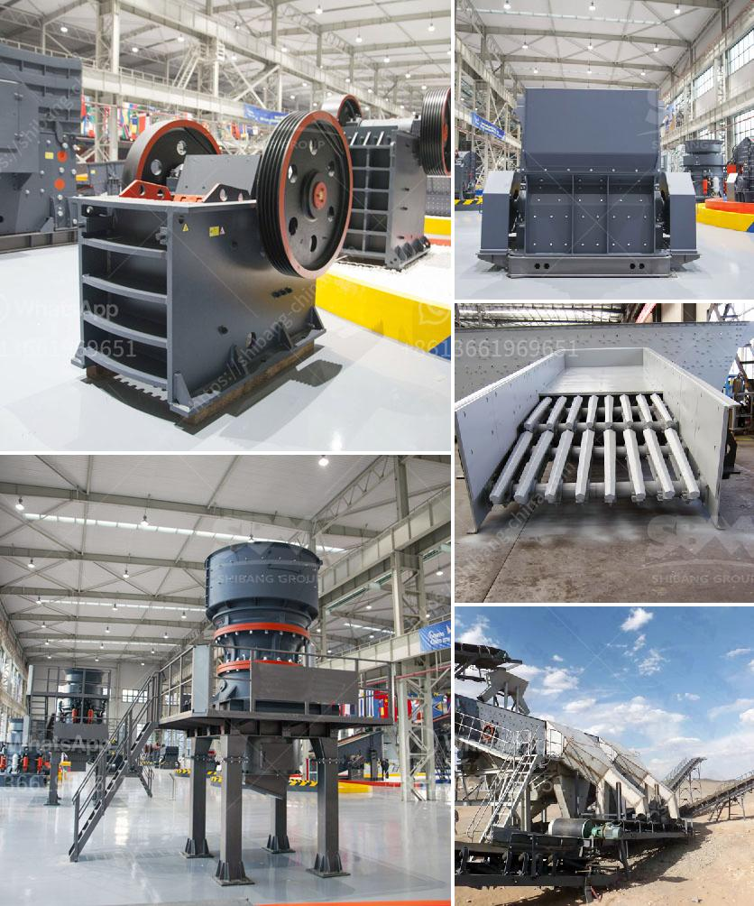

<h3>rock crusher mine price peru</h3>
The mining industry plays a crucial role in the economic development of countries around the world. From gold and silver to copper and zinc, various minerals extracted from mines are essential raw materials for industries such as construction, manufacturing, and energy production. In Peru, one of the leading mining nations in Latin America, an innovative rock crusher mine price has emerged as a game-changer for the industry.

The rock crusher mine price Peru has become a central focus for mining companies looking to optimize their operations. This specialized equipment is designed to break down large rocks into smaller, more manageable sizes, allowing for easier processing and transportation. By reducing the size of rocks and minerals, the rock crusher directly contributes to increasing productivity and efficiency in mining operations.

One of the key advantages of the rock crusher mine price Peru is its affordability. Traditional crushing methods involve heavy machinery and significant manpower. These methods come with high operational and maintenance costs. In contrast, a rock crusher offers a cost-effective solution, often requiring less capital investment upfront and reducing long-term expenses associated with maintenance. This affordability factor makes the rock crusher an attractive option, especially for small to medium-sized mining companies.

Furthermore, the rock crusher mine price Peru offers exceptional versatility. Its adaptability enables mining companies to process various types of minerals efficiently. Whether it is limestone, granite, or mineral ores like gold and copper, the rock crusher can handle diverse materials without compromising its performance. This adaptability opens up opportunities for mining companies to diversify their operations and explore different mineral resources.

Another noteworthy advantage of the rock crusher mine price Peru is its mobility. Mining operations often involve extracting minerals from different locations within a mine site. As the name suggests, a mobile rock crusher can be easily moved from one place to another, maximizing its utilization across different areas of the mining site. This mobility allows for faster and more flexible processing, reducing the time and effort required to transport rocks and minerals to a stationary crusher.

Moreover, the deployment of a rock crusher in mining operations enhances safety measures. The use of heavy machinery and explosives in traditional mining methods pose significant risks to workers. By using a rock crusher, miners can mitigate these hazards by minimizing the need for direct contact with explosive materials. Safety measures such as remote operation and advanced control systems add an extra layer of protection for workers, reducing the occurrence of accidents and injuries.

In conclusion, the rock crusher mine price Peru is revolutionizing the mining industry by offering a practical and cost-effective solution for extracting and processing minerals. Its affordability, versatility, mobility, and safety features make it an invaluable tool for mining companies of all sizes. The rock crusher provides a competitive advantage to mining operations in Peru and beyond, paving the way for increased efficiency, productivity, and profitability. As the mining sector evolves, the rock crusher will undoubtedly continue to be a game-changer, shaping the future of the industry.
<h3>Contact us</h3><ul><li><strong>Whatsapp:&nbsp;<a href="https://wa.me/8613661969651">+8613661969651</a></strong></li><li><a href="https://swt.shibang-china.com/?git&amp;zhl&amp;rock crusher mine price peru"><strong>Online Service(chat now)</strong></a></li></ul><h3>Related</h3><ul><li><a href='nigeria cone crusher.md'>nigeria cone crusher</a></li><li><a href='gravel cone crusher for sale.md'>gravel cone crusher for sale</a></li><li><a href='used ball mills for sale.md'>used ball mills for sale</a></li><li><a href='track mounted mobile crusher plant.md'>track mounted mobile crusher plant</a></li><li><a href='mobile coal washing plant investment.md'>mobile coal washing plant investment</a></li></ul>