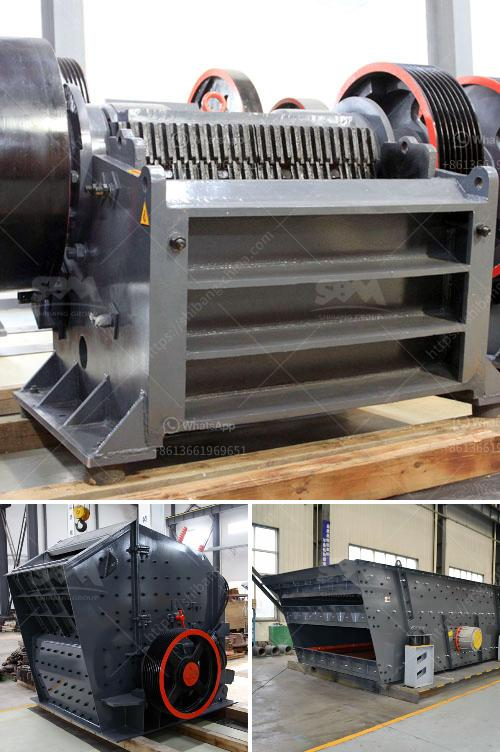

<h3>rock crusher plant price</h3>
Rock crusher plant price is an important factor which is considered by customers when purchasing rock crushing equipment. The obvious question is how to choose the right equipment with reasonable rock crusher plant price. The first thing to consider is the production capacity. The capacity refers to the throughput or the amount of material that can be processed per unit time. The higher the capacity, the higher the rock crusher plant price. For example, 100-150 tph rock crushing plant is expensive than a 50-100 tph plant because of the larger capacity. The third element is the plant configuration. Here, different machines are required such as a jaw crusher for primary crushing, impact crusher or cone crusher for secondary crushing, and VSI crusher for tertiary crushing. Therefore, the rock crusher plant configuration must be flexible in order to meet clients’ requirements on material specifications and production capacity. 

Another consideration is the raw material. Different types of rocks have different hardness levels, so the rock crusher plant price level will vary depending on the type of material being processed. The hardness of the rocks also determines the type of crusher to be used. For example, a jaw crusher is commonly used for primary crushing tasks because of its high hardness level and abundance materials. On the other hand, cone crushers are more suitable for accepting larger feed sizes and for crushing harder materials. 

The size and shape of the desired final product is another important factor to consider when purchasing a rock crusher plant. Some customers have strict requirements on finished product size so they choose the rock crushing plant with cone crushers or impact crushers. However, others may prefer a rock crusher plant with a jaw crusher which is more versatile. The different crushing machines are used to obtain specific sizes of desired products that are needed for construction and other industries. 

The geographical location of the plant is also a factor to consider when calculating the rock crusher plant price. Because different places have different material costs, transportation costs, and labor costs. Therefore, purchasing a rock crusher plant near a city or urban area can save transportation costs. Conversely, locating a rock crushing plant in a remote area or mountainous region may result in higher costs due to transportation challenges. 

Lastly, the brand reputation and after-sales service of the supplier should not be neglected. Choosing a reputable supplier with good after-sales service can provide customers with a sense of security and peace of mind. A reliable supplier will not only provide high-quality rock crushing equipment but also offer prompt technical support and spare parts supply. 

In conclusion, the rock crusher plant price is a crucial factor to consider when purchasing equipment. It’s important to choose a suitable rock crusher plant configuration, consider the raw material, desired final product size, geographical location, and supplier reputation. By considering all these factors, customers can choose a rock crusher plant with the right price and meet their production needs.
<h3>Contact us</h3><ul><li><strong>Whatsapp:&nbsp;<a href="https://wa.me/8613661969651">+8613661969651</a></strong></li><li><a href="https://swt.shibang-china.com/?git&amp;zhl&amp;rock crusher plant price"><strong>Online Service(chat now)</strong></a></li></ul><h3>Related</h3><ul><li><a href='portable crushing line.md'>portable crushing line</a></li><li><a href='california rock crusher machine.md'>california rock crusher machine</a></li><li><a href='portable crusher machine.md'>portable crusher machine</a></li><li><a href='stone crushers in uttarakhand.md'>stone crushers in uttarakhand</a></li><li><a href='quartz stone crushing unit in india.md'>quartz stone crushing unit in india</a></li></ul>