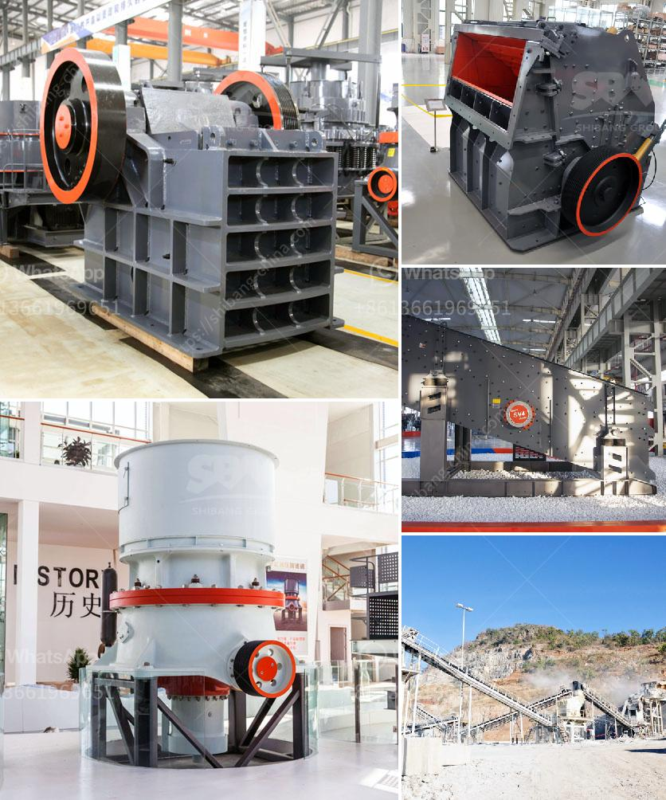

<h3>rock crusher price</h3>
Rock crushers are a fundamental part of many industrial and mining operations. They are built to withstand tough conditions and deliver immense power, even under the toughest circumstances. Rock crushers break down larger rocks into smaller pieces in order to be used for construction materials, making them an essential tool for construction companies, quarries, and other similar industries.

When it comes to purchasing a rock crusher, there are several factors to consider, and price is undoubtedly one of the most important ones. The price range for rock crushers varies greatly and depends on several factors such as the capacity, the brand, the type of machine, and the specific features it offers. In this article, we will discuss the price range for rock crushers and what you can expect when investing in one.

The prices of rock crushers can range from a few thousand dollars up to hundreds of thousands of dollars. The exact price depends on the capacity of the machine, the brand, and the specific features it offers. Smaller capacity crushers with basic features can start from around $4,000, while high-capacity crushers with advanced features can cost upwards of $150,000.

When considering the price of a rock crusher, it is important to keep in mind that the initial investment is not the only cost involved. Operational costs such as fuel, maintenance, and repairs must also be taken into account. Additionally, the cost of replacement parts and the availability of those parts should be considered. It is crucial to choose a rock crusher that is reliable, efficient, and has a good track record when it comes to availability of spare parts and after-sales service.

In general, rock crushers with higher capacities and more advanced features tend to be more expensive. However, they also offer better performance, higher productivity, and longer lifespan, which can offset the initial investment cost. On the other hand, smaller capacity rock crushers may have a lower purchase price, but they might not be as efficient or durable. Finding the right balance between price and performance is crucial to ensuring the best return on investment.

It is also worth noting that purchasing a used rock crusher can be a cost-effective solution. Used crushers can often be found at a lower price compared to brand-new ones, and while they might have slightly reduced performance or wear and tear, they can still be a good choice if properly inspected and maintained. However, it is important to conduct a thorough inspection and engage with a reputable seller or dealer when purchasing a used rock crusher to ensure its quality and longevity.

In conclusion, the price range for rock crushers can vary greatly depending on the capacity, brand, and specific features. It is important to consider not only the initial purchase price but also the operational costs and availability of spare parts. Ultimately, finding the right balance between price and performance is key to making a wise investment in a rock crusher.
<h3>Contact us</h3><ul><li><strong>Whatsapp:&nbsp;<a href="https://wa.me/8613661969651">+8613661969651</a></strong></li><li><a href="https://swt.shibang-china.com/?git&amp;zhl&amp;rock crusher price"><strong>Online Service(chat now)</strong></a></li></ul><h3>Related</h3><ul><li><a href='graphite crusher products.md'>graphite crusher products</a></li><li><a href='primary impact crusher.md'>primary impact crusher</a></li><li><a href='crushing equipment from.md'>crushing equipment from</a></li><li><a href='clay crusher machine in india.md'>clay crusher machine in india</a></li><li><a href='sand maker machines.md'>sand maker machines</a></li></ul>