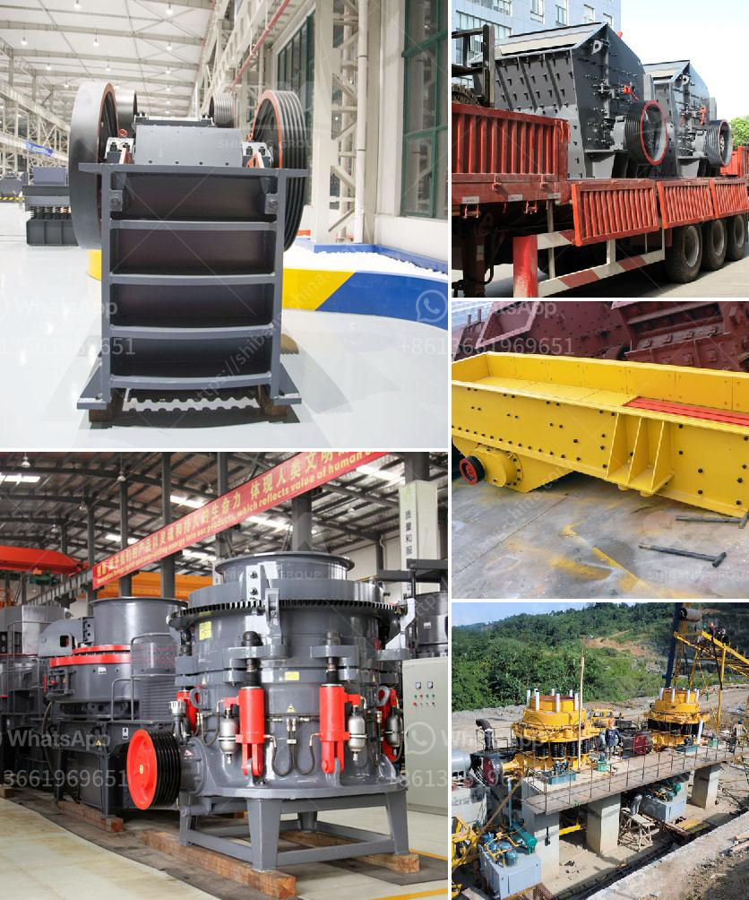

<h3>rock crusher uganda</h3>
Rock crushing is an integral part of the construction industry in Uganda. With the increasing demand for building materials and infrastructure development, concrete aggregates are in high demand. A rock crusher, also known as a stone crusher, helps businesses and contractors crush stones to make aggregates for concrete production.

In Uganda, rock crushers are increasingly being commissioned to produce aggregate materials for road construction. This trend, which has been steadily growing for years, is expected to continue as the government strives to improve infrastructure such as roads, highways, and bridges. Rock crushers play a crucial role in this process by reducing the size of large stones into smaller, more manageable pieces.

One of the primary advantages of using a rock crusher is its ability to produce a consistent, high-quality aggregate. By crushing the stones consistently, the resulting aggregate maintains an even shape and size, which is essential for the successful construction of roads. The uniformity of the aggregate also ensures better compaction, ensuring that the road has a strong foundation and longer lifespan.

Rock crushers in Uganda come in various types, including jaw crushers, cone crushers, and impact crushers. The crushers are versatile machines that are capable of performing multiple tasks simultaneously. They can be used for crushing stones, recycling materials, or even in the mining industry to break down ores into smaller pieces.

When selecting a rock crusher, it is essential to consider various factors such as the desired output size, the hardness of the stones, and the capacity of the crusher. For instance, jaw crushers are ideal for primary crushing applications, whereas cone crushers are better suited for secondary or tertiary crushing. Additionally, impact crushers are commonly used to produce fine aggregates.

In Uganda, locally made rock crushers are relatively affordable and readily available. However, there are also imported crushers that are high-quality and offer superior performance. This variety allows businesses and contractors to choose the most suitable rock crusher based on their specific needs and budget.

As rock crushers are heavy-duty machines, regular maintenance and proper operating practices are crucial to ensure their longevity and optimal performance. Routine inspections, lubrication, and replacement of worn-out parts are essential steps to prevent breakdowns and costly downtime. Furthermore, operators must follow safety guidelines and wear appropriate protective gear to minimize workplace accidents and injuries.

In conclusion, rock crushers are invaluable machines in the construction industry in Uganda. They help businesses and contractors produce high-quality aggregates for road construction and other infrastructure projects. Whether locally made or imported, rock crushers are essential equipment that contribute significantly to the development of the country's infrastructure. Therefore, investing in a good-quality rock crusher and adhering to proper maintenance practices can yield impressive results, both in terms of productivity and profitability.
<h3>Contact us</h3><ul><li><strong>Whatsapp:&nbsp;<a href="https://wa.me/8613661969651">+8613661969651</a></strong></li><li><a href="https://swt.shibang-china.com/?git&amp;zhl&amp;rock crusher uganda"><strong>Online Service(chat now)</strong></a></li></ul><h3>Related</h3><ul><li><a href='crushing of concrete in pakistan.md'>crushing of concrete in pakistan</a></li><li><a href='coal mill grinding rolls.md'>coal mill grinding rolls</a></li><li><a href='mobile stone crusher in saudi.md'>mobile stone crusher in saudi</a></li><li><a href='vibro feeder price listing south africa.md'>vibro feeder price listing south africa</a></li><li><a href='concrete recycling crushing plant crusher for sale.md'>concrete recycling crushing plant crusher for sale</a></li></ul>