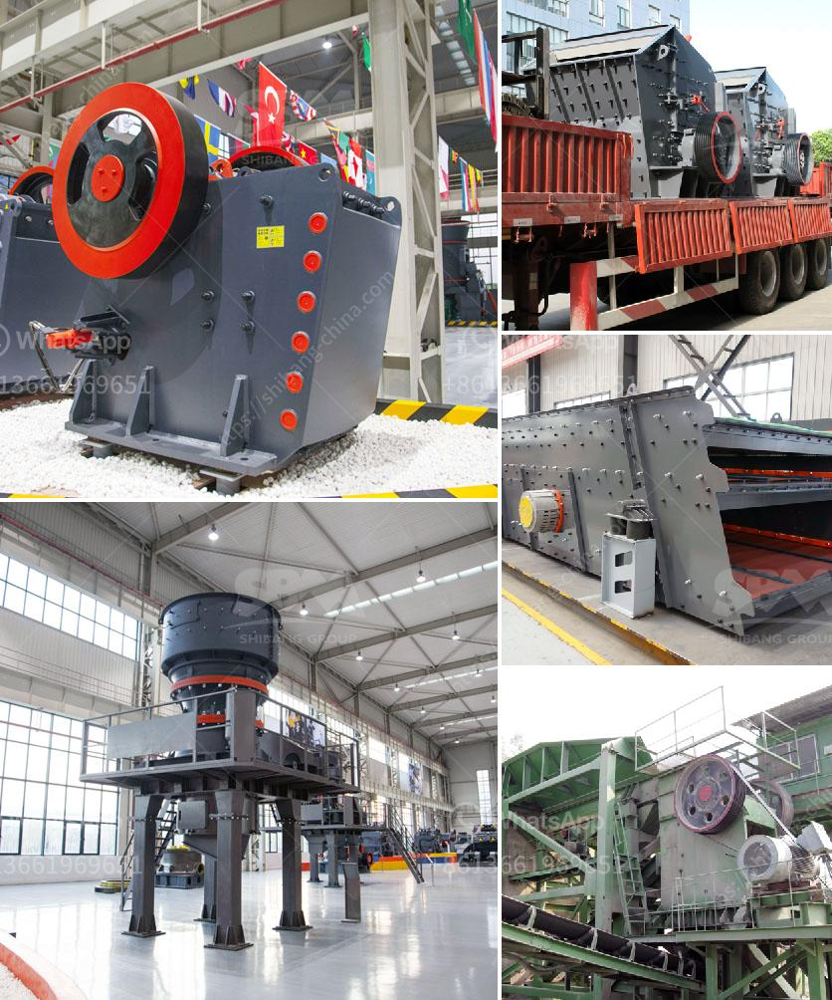

<h3>rock crushers manufacturers</h3>
Rock crushers are machines used to break down big rocks into smaller pieces. They are mainly used in industries such as mining and construction for the purpose of reducing the size of big materials to a manageable size for further processing. Rock crushers play a crucial role in many different applications, and therefore, finding a reliable rock crushers manufacturer is essential.

When it comes to choosing a rock crushers manufacturer, there are several factors to consider. Firstly, a reputable manufacturer should have a strong reputation in the industry. This can be determined by reading customer reviews, looking at their track record, and assessing their experience in the field. It is important to choose a manufacturer with a proven track record of producing high-quality rock crushers.

Another factor to consider is the range of rock crushers offered by the manufacturer. A good manufacturer should offer a variety of crushers to meet different needs and requirements. This includes crushers with different capacities, designs, and features. Having a wide range of options ensures that customers can find the right crusher for their specific application.

In addition, a reliable rock crushers manufacturer should provide excellent after-sales service. This includes offering technical support, providing spare parts, and ensuring prompt and efficient maintenance and repairs. It is also important to choose a manufacturer that offers a warranty for their products, as this demonstrates their confidence in the quality of their crushers.

Furthermore, cost and efficiency are crucial factors to consider. A good manufacturer should provide crushers that are not only cost-effective but also efficient in terms of energy consumption and productivity. It is important to choose a manufacturer that offers value for money and can provide crushers that maximize productivity while minimizing operational costs.

In conclusion, finding a reputable rock crushers manufacturer is essential for industries that rely on these machines. Factors such as reputation, range of crushers, after-sales service, cost, and efficiency should be considered when choosing a manufacturer. By selecting the right manufacturer, businesses can ensure they have reliable and efficient rock crushers that meet their specific needs.
<h3>Contact us</h3><ul><li><strong>Whatsapp:&nbsp;<a href="https://wa.me/8613661969651">+8613661969651</a></strong></li><li><a href="https://swt.shibang-china.com/?git&amp;zhl&amp;rock crushers manufacturers"><strong>Online Service(chat now)</strong></a></li></ul><h3>Related</h3><ul><li><a href='labaratory ball mill for minerals.md'>labaratory ball mill for minerals</a></li><li><a href='rock crushing machine for concrete use.md'>rock crushing machine for concrete use</a></li><li><a href='quotes hammer mill.md'>quotes hammer mill</a></li><li><a href='ore crushing machine.md'>ore crushing machine</a></li><li><a href='bauxite manufacture equipment in india.md'>bauxite manufacture equipment in india</a></li></ul>