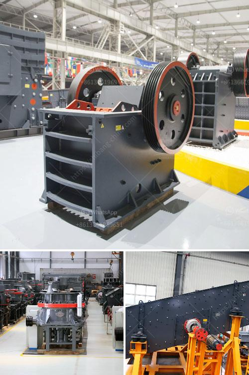

<h3>rock crushing machine for concrete use</h3>
In the construction industry, there is always a need for breaking down materials such as concrete, asphalt, and rocks into smaller pieces. Rock crushing machines, also known as rock crushers, are essential tools for demolition contractors, as they allow professionals to pulverize large rocks into smaller aggregates, making it easier to dispose of and recycle materials. Whether it's on a construction site or at a quarry, these machines are invaluable in the process.

One of the most common applications for rock crushing machines is in the concrete industry. Concrete is a versatile building material, and its use spans across various construction projects. However, there are instances when concrete structures need to be demolished or renovated, and that's where rock crushers come into play. They transform heavy concrete materials into smaller, more manageable sizes, ready to be reused or disposed of.

When it comes to rock crushing machines for concrete use, jaw crushers are the most common choice. A jaw crusher works like a giant human jaw, chewing and breaking down large concrete materials into smaller, more manageable pieces. The crushing process occurs when two plates, one stationary and one movable, come together, squeezing the concrete material between them. This action applies pressure and breaks the material into smaller fragments.

The benefits of using a rock crushing machine for concrete use are abundant. First and foremost, it saves time and labor. Without a crusher, breaking down concrete manually can be a time-consuming and physically demanding task. Having a machine do the work significantly speeds up the demolition process, allowing contractors to complete projects on schedule.

Additionally, using rock crushers for concrete use contributes to environmental sustainability. Concrete waste is a substantial issue in the construction industry, and proper disposal is crucial to minimizing its impact. By utilizing a rock crusher for concrete crushing, contractors can reduce the volume of waste materials, making transportation and disposal more efficient. Moreover, some crushed concrete can be recycled and used as aggregate for new concrete or as a base material in road construction.

Another advantage of utilizing a rock crushing machine for concrete use is cost-effectiveness. Instead of disposing of concrete waste and purchasing new materials, contractors can repurpose the crushed concrete as fill material, resulting in significant cost savings.

It's important to note that rock crushing machines for concrete use come in various sizes and configurations to meet specific job requirements. Portable crushers, for example, can be easily transported to different job sites, allowing contractors to take advantage of their versatility. Furthermore, some machines can be attached to excavators or loaders, providing added convenience and efficiency.

In conclusion, rock crushing machines for concrete use are indispensable tools for demolition contractors. They enable the efficient breakdown of concrete, saving time and labor, while promoting environmental sustainability and cost-effectiveness. Whether it's a smaller portable crusher or a stationary jaw crusher, these machines play a vital role in the construction industry by facilitating the recycling and reuse of concrete materials.
<h3>Contact us</h3><ul><li><strong>Whatsapp:&nbsp;<a href="https://wa.me/8613661969651">+8613661969651</a></strong></li><li><a href="https://swt.shibang-china.com/?git&amp;zhl&amp;rock crushing machine for concrete use"><strong>Online Service(chat now)</strong></a></li></ul><h3>Related</h3><ul><li><a href='quartz stone making process.md'>quartz stone making process</a></li><li><a href='mobile crusher parker 50th crusher for sale.md'>mobile crusher parker 50th crusher for sale</a></li><li><a href='belt conveyor design free.md'>belt conveyor design free</a></li><li><a href='china vertical roller mill prices.md'>china vertical roller mill prices</a></li><li><a href='limestone beneficiation process.md'>limestone beneficiation process</a></li></ul>