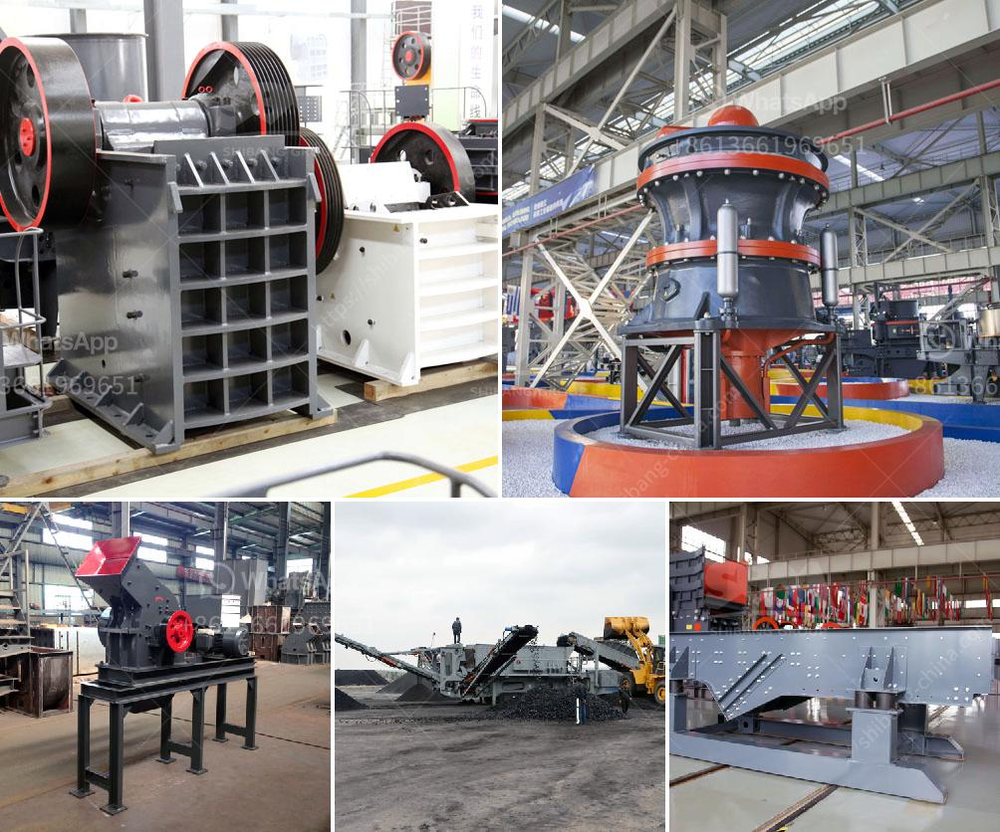

<h3>rock crushing machine speed limit</h3>
Rock crushing machines are powerful equipment used to break down larger rocks into smaller, more manageable pieces. They are commonly used in construction, mining, and demolition industries to process materials such as limestone, granite, and concrete. However, just like any other heavy machinery, it is crucial to implement and adhere to speed limits to ensure both efficiency and safety.

One might wonder why there is a need for speed limits when operating rock crushing machines. After all, the faster the machine operates, the greater the productivity, right? While it is true that high speeds can enhance production rates, there are several factors that must be taken into consideration to strike a balance between efficiency and safety.

Firstly, the physical properties of the material being processed play a crucial role. Different rocks have varying hardness and brittleness levels. While some rocks can shatter easily, others may require more force, which can be achieved by operating the machine at higher speeds. Therefore, understanding the properties and characteristics of the material is essential to determine the optimal speed for crushing.

Secondly, the machine itself has limitations that must be considered. Each crusher has specific technical specifications and operating parameters provided by the manufacturer. Deviating from these limits can lead to mechanical failure, increased maintenance costs, and even safety hazards. Therefore, it is vital to follow these guidelines and operate the machine within the designated speed range to maximize efficiency and durability.

Another crucial aspect is operator safety. Rock crushing machines consist of a rotating drive shaft that powers a crushing cone or a hammer, depending on the design. These components can exert tremendous force, making it essential to control the speed to ensure operator safety. Higher speeds can increase the likelihood of accidents, such as material being ejected from the machine or components being damaged due to excessive vibrations.

In addition to material characteristics and machine limitations, environmental factors should not be disregarded. For instance, working in dusty or wet conditions might require adjusting the speed to maintain optimal performance. Dust can clog the machine's mechanisms and reduce its efficiency, while wet material may stick, leading to lower productivity. By adhering to speed limits, operators can prevent these issues and maintain peak performance.

However, determining the ideal speed range isn't always straightforward. Many factors need to be considered, such as material properties, machine capabilities, operator experience, and the specific job requirements. It is crucial for operators to undergo proper training and receive guidelines from the equipment manufacturer to fully understand the safe and efficient operation of the rock crushing machine.

In conclusion, speed limits play a vital role in operating rock crushing machines. While higher speeds can enhance productivity, they must be balanced with safety considerations, material properties, machine limitations, and environmental factors. By adhering to recommended speed limits, operators can strike a balance between efficiency and safety, preventing accidents, reducing maintenance costs, and ensuring optimal performance of the crushing machine.
<h3>Contact us</h3><ul><li><strong>Whatsapp:&nbsp;<a href="https://wa.me/8613661969651">+8613661969651</a></strong></li><li><a href="https://swt.shibang-china.com/?git&amp;zhl&amp;rock crushing machine speed limit"><strong>Online Service(chat now)</strong></a></li></ul><h3>Related</h3><ul><li><a href='stone crusher in himachal pradesh.md'>stone crusher in himachal pradesh</a></li><li><a href='gold wash plant at south africa gold mine.md'>gold wash plant at south africa gold mine</a></li><li><a href='tph mobile crushing plant.md'>tph mobile crushing plant</a></li><li><a href='stone quarry crusher project report pdf.md'>stone quarry crusher project report pdf</a></li><li><a href='cost of coal washing plant.md'>cost of coal washing plant</a></li></ul>