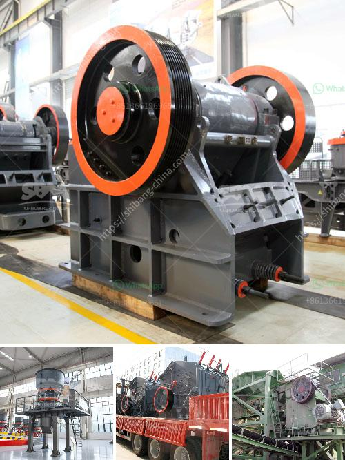

<h3>rock crushing plants for sale</h3>
If you are in the market for a rock crushing plant, finding the right equipment is crucial. With the wide range of options available in the market, it can be a daunting task to find the perfect crushing machine for your needs. However, with careful research and consideration, you can find a rock crushing plant that will efficiently and effectively crush the rocks you require for your projects. In this article, we will discuss some key factors to consider when searching for rock crushing plants for sale.

Firstly, it is important to understand the specific requirements and demands of your projects. Determine the size, type, and quantity of rocks you need to crush. This will help you narrow down the options and find a crushing machine that can handle the workload efficiently. Consider the output capacity of the machine, and ensure that it meets the demands of your projects. Some crushing plants are capable of producing large volumes of crushed rocks, while others may be more suited for smaller scale operations.

Secondly, consider the type of rocks you need to crush. Different rocks have different hardness levels, and not all crushing machines are capable of handling all types of rocks. Some rocks require more power and force to be crushed effectively. Therefore, it is important to choose a crushing machine that is specifically designed for the type of rocks you are working with. Look for machines with the necessary features and specifications to crush the rocks you require.

Another aspect to consider is the mobility of the rock crushing plant. Will you be working in a stationary location or will you need to move the equipment frequently? Portable rock crushing plants are a popular choice for contractors who need to move their equipment to different job sites. They offer flexibility and convenience, allowing you to crush rocks at various locations without the need for disassembling and reassembling the machine.

Additionally, it is important to consider the maintenance and servicing requirements of the crushing machine. Choose a rock crushing plant that is easy to maintain and service, as this will save you time and money in the long run. Look for machines with simple and accessible parts that can be easily replaced or repaired in case of breakdowns. Opt for reputable brands with a good track record for customer support and after-sales service.

Lastly, consider your budget when searching for rock crushing plants for sale. Determine your available budget and try to find a machine that offers the best value for money. Compare prices and features from different suppliers and manufacturers to make an informed decision. Remember, the cheapest option may not always be the best choice, as quality and reliability are key factors when it comes to crushing machines.

In conclusion, finding the perfect rock crushing plant for sale requires careful consideration of your specific requirements, the type of rocks you need to crush, the mobility of the equipment, the maintenance requirements, and your available budget. By taking all these factors into account, you can find a crushing machine that will efficiently crush rocks for your projects, ensuring success and value for your investment.
<h3>Contact us</h3><ul><li><strong>Whatsapp:&nbsp;<a href="https://wa.me/8613661969651">+8613661969651</a></strong></li><li><a href="https://swt.shibang-china.com/?git&amp;zhl&amp;rock crushing plants for sale"><strong>Online Service(chat now)</strong></a></li></ul><h3>Related</h3><ul><li><a href='crusher stone durban.md'>crusher stone durban</a></li><li><a href='used crusher rock mining germany.md'>used crusher rock mining germany</a></li><li><a href='technical features of stone crusher.md'>technical features of stone crusher</a></li><li><a href='crushers in malaysia.md'>crushers in malaysia</a></li><li><a href='material using for making talcum powder.md'>material using for making talcum powder</a></li></ul>