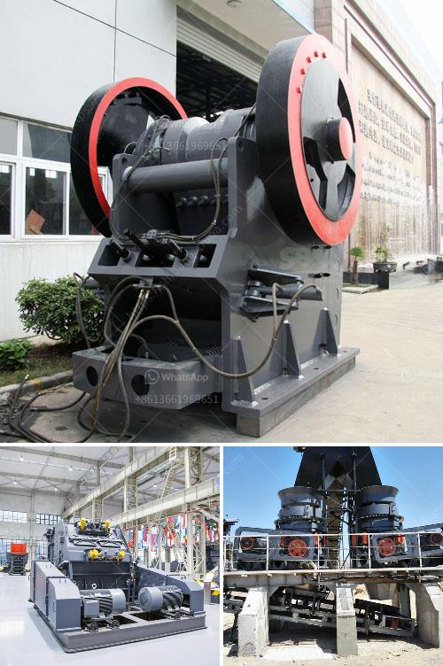

<h3>rock grinding mill price in india</h3>
Rock grinding mill is widely used in India for rock processing. In India, grinding mill is mainly used for grinding hard rock materials. Grinding mills have different forms, such as ball mill, rod mill, and vertical mill. Rock grinding mill price in India is reasonable. Rock Grinding Mill Introduction: Rock grinding mill is vital equipment for grinding rock. Rock grinding mill is mainly used for grinding medium hard or soft materials, such as phosphate rock, gypsum, glass, limestone, marble, talc, potash feldspar, dolomite, coal, copper, gold, iron ore, rock phosphate prices,buy quality rock phosphate prices from 2500 mesh rock phosphate grinding mill price min order 1 set fob price us set supply ability 1000 set sets per year phosphate rock grinding mill 1. Rock Grinding Mill Price In Nigeria. Grinding Mill Grinding Mill Spare Parts Manufacturer From. Grinding mill and spare parts danish type grinding mills are having one ball bearing on pulley side and one ball bearing in the other side the position of three bearing of our mill are standing in one center as per below design 1610 16 inch 400 mm 1612 16 inch 450 mm How Much Does Rock Grinding Mill Phil Peru Cost Grinding Mills Category Production of free combination from 0 to 2500 meshes can be realized. No matter which industry you are in, chemistry, energy, construction material or metallurgy field, A&C will always meet all your demands. Get grinding mill at best price with product specifications. Listed grinding mill manufacturers, suppliers, dealers & exporters are offering best deals for grinding mill at your nearby location. Rock Grinding Mill Price In Seychelles 70 tonnes of rock from our back garden end mill grinding fixture instructions crusher prices in kerala india crusher coal insurance antique rock crushers on ebay america grinding aids seminar why is rock crusher important rajasthan suppliers for aggregates cement mill performance prophet income model roller mills Stirred mills amp Tower mills simple effective and cost efficient As lower ore grades and complex mineralogy are driving demand for more efficient fine grinding you can depend on for a full range of fine-grinding mills designed for easy shipment simple erection and trouble-free maintenance... Rock Grinding Mill Price. Quart Rock Crusher MachineSand Fine Grinding Mill. 20171025Quart Fine Grinding Mill. Quart grinding mill plant is the industrial grinding plant used to grinding quart in mining industry including ball mill Raymond mill vertical mill etc. Stone milling machine is used to grinding crushed quart materials after crushing process during the plants. Rock Phosphate Grinding Mill Prices In Pakistan rock concrete grinding mill prices in pakistan. rock concrete ball mills suppliers of india, . Contact verified Rock Phosphate Grinding Mill Manufacturers, . Get Price And Support Online; Ball Mill For Phosphate Grinding Chinadkptti. Rock Phosphate Grinding Plant Pakistan,Ball Mill for Rock ... Rock Grinding Mill Price In India. Milling Equipment: rock grinding mill price in india - A class of machinery and equipment that can be used to meet the production requirements of coarse grinding, fine grinding and super fine grinding in the field of industrial grinding.The finished product can be controlled freely from 0 to 3000 mesh. More Details Darwins Old Time Slots Antique slot . Antique Slot Machines and Stained Glass are the. rock grinding mill price in nigeria price of grinding mill in Nigeria. Contact Supplier. Buy Hand Power Tools at Lowest Prices Jumia Nigeria. The power at which a machine does its best will ultimately influence your decision to buy a wireless drilling machine. The voltage also ultimately impacts the weight of the drill. Power Saws. Ball Mill Grind And Blending Equipments Mineral Dressing. Ball mill & rod mill from henan Mining Machinery Co., Ltd.. Search High Quality ball mill & rod mill Manufacturing and Exporting supplier on Alibaba.com. SBM online shopping india raymond coa China high efficiency calcite grinding China high efficiency calcite grinding mill with large capacity, find. Rock Grinding Mill Price In Seychelles. Metal rocks primary stone crusher secndery crusher used in minning of copper crusher nickel graphite design and operation of wet crushing cone crusher how to crush silica stone bulgarian mining equipments tlb diesel engines allaboutfeed grinding barleyrich pig feed with

Our main products include crushing equipment, sand making equipment, beneficiation equipment, grinding equipment and building materials equipment, welcome to purchase;

We have a variety of crushing and mining equipment, if you need to know about our products, please contact us directly.
<h3>Contact us</h3><ul><li><strong>Whatsapp:&nbsp;<a href="https://wa.me/8613661969651">+8613661969651</a></strong></li><li><a href="https://swt.shibang-china.com/?git&amp;zhl&amp;rock grinding mill price in india"><strong>Online Service(chat now)</strong></a></li></ul><h3>Related</h3><ul><li><a href='price high energy ball milling.md'>price high energy ball milling</a></li><li><a href='marble powder grinding plant manufacturer.md'>marble powder grinding plant manufacturer</a></li><li><a href='high pressure micro powder grinder in india.md'>high pressure micro powder grinder in india</a></li><li><a href='coal conveyor blet supplier from india.md'>coal conveyor blet supplier from india</a></li><li><a href='gold mining equipment manufacturer.md'>gold mining equipment manufacturer</a></li></ul>