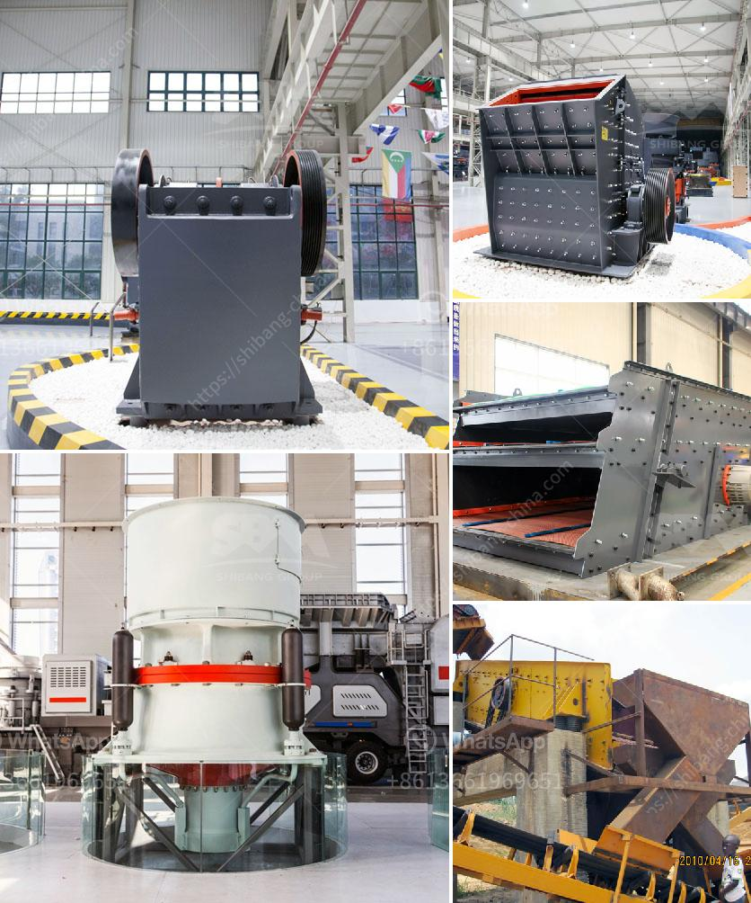

<h3>roll crusher used equipment tph coal russian</h3>
A roll crusher is a piece of heavy-duty equipment used in mining and industrial processes. It features a pair of large wheels or cylinders mounted on horizontal axis. When rocks, ore, and other materials pass between the two cylinders, they are crushed or ground into smaller pieces. Roll crushers are commonly used for crushing coal, limestone, cement clinker, and more.

In Russia, coal is one of the most important resources, especially in remote regions where deposits are abundant but transportation infrastructure is lacking. To extract and process coal, extensive machinery and equipment are required, amongst which roll crushers play a crucial role. These machines provide an effective, efficient, and economical way of reducing coal size.

One of the key advantages of roll crushers is their ability to produce a uniform product size distribution. This is achieved by narrowing the gap between the two cylinders to control the desired output size. By adjusting this gap, operators can optimize their process and ensure consistent quality coal for subsequent operations, such as transportation and combustion.

Roll crushers used in coal processing typically have capacities ranging from 300 to 500 TPH. This makes them suitable for medium-to-large operations with high throughput requirements. However, their actual capacity depends on the material properties and gap setting between the cylinders. For instance, harder and larger coal may require a smaller gap to achieve the desired size reduction.

To ensure reliable and efficient operation, roll crushers are equipped with various safety features. These include automatic overload protection, adjustable gap settings, and emergency stop buttons. Additionally, modern roll crushers often come with advanced monitoring systems, such as vibration sensors and temperature sensors, which help detect potential issues and prevent unexpected breakdowns.

In the Russian coal industry, roll crushers are commonly used in coal preparation plants (CPPs), where coal is processed to remove impurities and improve its quality. CPPs typically have several stages of crushing and grinding, starting with a primary crusher to reduce the coal size. Next, secondary crushers, such as roll crushers, further reduce the coal size to the desired size before being transported to the next stage of processing.

Roll crushers used in coal preparation plants usually have a dual drive system, consisting of two motors with separate gearboxes and motors. This setup ensures smooth and continuous operation even in the event of a motor failure, providing greater reliability and minimizing downtime.

In conclusion, roll crushers are essential equipment in the Russian coal industry, particularly in remote regions where infrastructure is limited. With their ability to produce a uniform product size distribution and their capacity ranging from 300 to 500 TPH, roll crushers offer an effective solution for reducing coal size. Equipped with various safety features and monitoring systems, they ensure reliable and efficient operation, helping to optimize coal processing and improve overall productivity.
<h3>Contact us</h3><ul><li><strong>Whatsapp:&nbsp;<a href="https://wa.me/8613661969651">+8613661969651</a></strong></li><li><a href="https://swt.shibang-china.com/?git&amp;zhl&amp;roll crusher used equipment tph coal russian"><strong>Online Service(chat now)</strong></a></li></ul><h3>Related</h3><ul><li><a href='puzzolana crusher tonnes per hour.md'>puzzolana crusher tonnes per hour</a></li><li><a href='crushing machine price.md'>crushing machine price</a></li><li><a href='price of stone crusher machine in nigeria.md'>price of stone crusher machine in nigeria</a></li><li><a href='stone crusher manufacturers in ludhiana.md'>stone crusher manufacturers in ludhiana</a></li><li><a href='stone hammer mill machine.md'>stone hammer mill machine</a></li></ul>