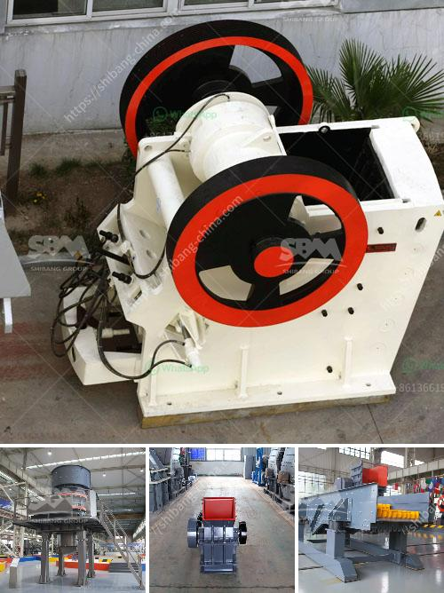

<h3>roller coal mill</h3>
Roller coal mill, also known as coal grinding mill or coal mill pulverizer, is a type of grinding equipment developed specifically for grinding coal in large-scale thermal power plants or steel mills. It is designed to grind coals of various hardnesses, ranging from lignite to anthracite.

One of the key benefits of this roller coal mill is its ability to grind coal to a desired fineness, resulting in a more efficient combustion process in the boiler. This is achieved by grinding the coal between the rotating grinding table and the rollers, which exert grinding pressure on the coal particles.

The coal is fed into the mill through a central inlet pipe, where it falls onto the grinding table. The table rotates at a constant speed, and the coal is ground between the table and the rollers. As the coal particles are ground, they are swept up by a stream of hot air, which dries the coal and carries it towards the classifier.

The role of the classifier in the roller coal mill is to separate the coal particles of the desired size from those that are too large or too small. This ensures that only the properly sized coal particles are fed into the burner for combustion, improving the overall efficiency of the coal-fired power plant or steel mill.

In addition to improving combustion efficiency, roller coal mills also offer other advantages. For example, they have a compact design, which requires less space compared to other types of coal mills. This is important in power plants and steel mills where space is often limited.

Furthermore, roller coal mills are highly reliable and require minimal maintenance. They are equipped with automatic lubrication systems, which ensure that the grinding rollers and other components are properly lubricated at all times. This helps to prolong the lifespan of the equipment and reduce downtime for maintenance and repairs.

Another advantage of roller coal mills is their ability to handle different types of coal with varying moisture content. The hot air used for drying the coal can be adjusted to suit the specific moisture content of the coal, ensuring efficient grinding and drying even when the moisture content varies.

In conclusion, roller coal mills are a crucial piece of equipment in thermal power plants and steel mills. They offer efficient and reliable coal grinding, which improves the combustion efficiency and overall performance of these facilities. With their compact design, minimal maintenance requirements, and ability to handle different types of coal, roller coal mills are an essential part of the coal grinding process.
<h3>Contact us</h3><ul><li><strong>Whatsapp:&nbsp;<a href="https://wa.me/8613661969651">+8613661969651</a></strong></li><li><a href="https://swt.shibang-china.com/?git&amp;zhl&amp;roller coal mill"><strong>Online Service(chat now)</strong></a></li></ul><h3>Related</h3><ul><li><a href='stone crushing plants in malaysia.md'>stone crushing plants in malaysia</a></li><li><a href='stone dust making machine.md'>stone dust making machine</a></li><li><a href='used stone crushers for sale india.md'>used stone crushers for sale india</a></li><li><a href='concrete stone crusher south africa.md'>concrete stone crusher south africa</a></li><li><a href='vertical grinding machine for marble.md'>vertical grinding machine for marble</a></li></ul>