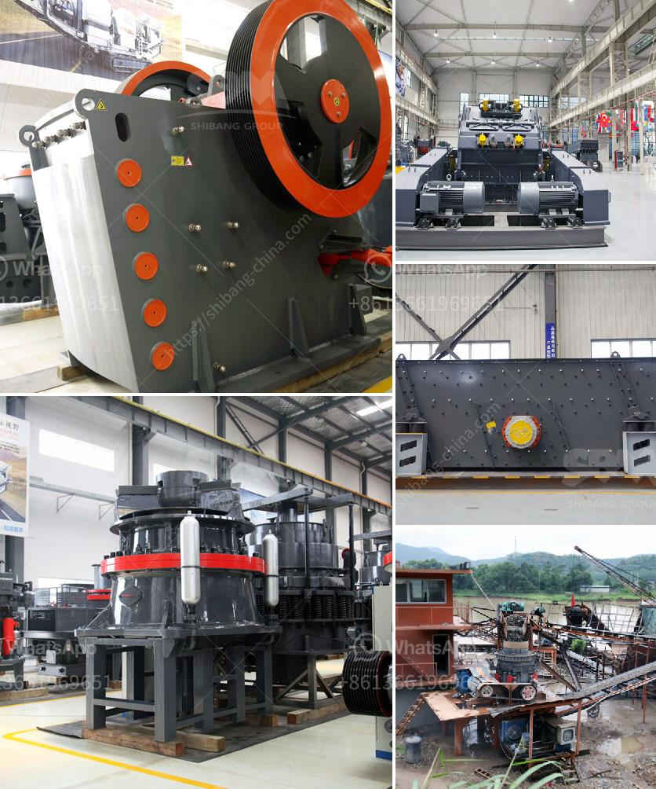

<h3>roller crusher for sale</h3>
Roller crushers have been a popular choice for many industrial applications for decades. These machines are perfect for crushing materials with a medium hardness, such as limestone, coal, and other materials used in various industries. With their unique high-pressure grinding mechanism, roller crushers create a significant amount of fines, ensuring the final product is of high quality.

One outstanding feature of roller crushers is their ability to handle a wide range of materials. From soft to hard, from wet to dry, roller crushers can efficiently process them all. This versatility makes roller crushers suitable for various applications, including mining, quarrying, and building materials.

Roller crushers consist of two parallel cylindrical rollers that rotate in opposite directions, with one roller positioned above the other. The material to be crushed enters the gap between the rollers, and an adjustable hydraulic system controls the pressure applied to the material. As the rollers rotate, they compress the material, breaking it down into smaller pieces.

One of the key advantages of roller crushers is their ability to produce a uniform product size distribution. As the material is crushed between the rollers, it is subjected to a high-pressure grinding action. This action ensures that the final product has a consistent size and shape, reducing the need for additional processing or screening. This is particularly beneficial in industries such as cement production, where a specific particle size is required for optimal performance.

Another advantage of roller crushers is their low energy consumption. Compared to traditional crushers, roller crushers require less power to operate, resulting in lower operational costs. This makes roller crushers an attractive option for businesses looking to reduce their energy expenditure.

Maintenance and upkeep of roller crushers are relatively simple. With properly lubricated components and routine inspections, roller crushers can operate for extended periods without any major issues. Additionally, many roller crusher models offer interchangeable wear parts, allowing for easy replacement when necessary. This feature further reduces maintenance downtime and ensures that the crusher remains in optimal working condition.

If you are considering investing in a roller crusher, there are several factors to consider. First and foremost, assess your specific material requirements and determine the desired product size. Additionally, consider the capacity requirements and the available space in your facility. Roller crushers come in various sizes and configurations, so there is likely a model that fits your needs.

In conclusion, roller crushers offer a reliable and efficient solution for crushing a wide range of materials. With their ability to produce a uniform product size distribution and their low energy consumption, roller crushers are an excellent choice for many industrial applications. When considering purchasing a roller crusher, thoroughly evaluate your material requirements and select a model that meets your specific needs.
<h3>Contact us</h3><ul><li><strong>Whatsapp:&nbsp;<a href="https://wa.me/8613661969651">+8613661969651</a></strong></li><li><a href="https://swt.shibang-china.com/?git&amp;zhl&amp;roller crusher for sale"><strong>Online Service(chat now)</strong></a></li></ul><h3>Related</h3><ul><li><a href='zimbabwe crusher rental.md'>zimbabwe crusher rental</a></li><li><a href='cement plant for sale in india 200 tpd.md'>cement plant for sale in india 200 tpd</a></li><li><a href='silica sand grinding.md'>silica sand grinding</a></li><li><a href='stone crusher portable.md'>stone crusher portable</a></li><li><a href='grinding machine philippines.md'>grinding machine philippines</a></li></ul>