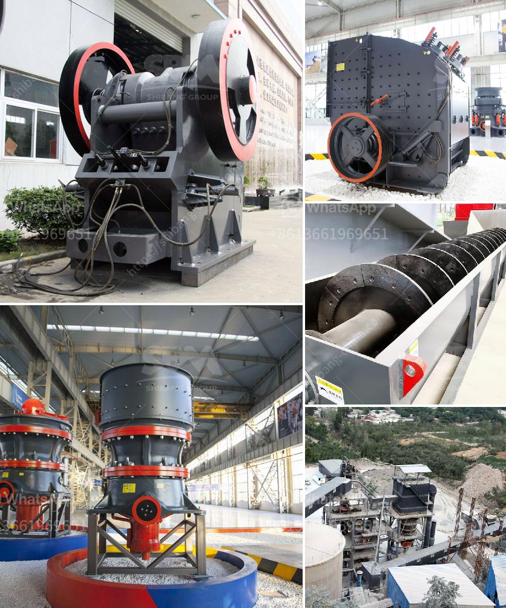

<h3>roller crusher in egypt</h3>
Egypt is known for its vast deserts, rich heritage, and famous historical sites. However, it is also a country with a growing economy, extensive infrastructure development, and a vibrant construction industry. In recent years, the roller crusher has gained traction in the Egyptian market due to its distinctive advantages over traditional crushers.

A roller crusher is a unique type of crusher that generates a crushing action on materials using a low-speed roller rotation. This equipment produces relatively uniform-sized particles, making it ideal for applications where particle size consistency is crucial. Moreover, roller crushers are efficient, energy-saving, and highly reliable, factors that contribute to their increasing popularity in Egypt.

One of the main reasons roller crushers are preferred over other crushers in Egypt is their ability to handle a wide range of materials. Whether it is limestone, gypsum, coal, or any other type of material, roller crushers can effectively break them into desired sizes. This versatility ensures that roller crushers can be used in various industries, including mining, construction, and cement production.

Furthermore, roller crushers are known to have lower operational and maintenance costs compared to traditional crushers. Due to their simple design and fewer moving parts, roller crushers require less frequent repairs and have longer service lives. This reduces the overall cost of ownership and allows businesses to allocate their budget to other critical aspects of their operations.

The energy-saving aspect of roller crushers is another reason for their popularity in Egypt. With the roller crusher's unique design, less energy is required to crush materials. This translates into lower electricity consumption and reduced carbon emissions. As Egypt focuses on sustainable development and reducing its environmental footprint, roller crushers offer an eco-friendly solution to material crushing needs.

Another advantage of roller crushers is their ability to produce relatively fine particles. This feature is particularly useful in construction projects where a high-quality finish is essential. By producing finer particles, roller crushers contribute to the production of smoother concrete, resulting in stronger structures and improved aesthetic appeal.

Furthermore, the compact size of roller crushers makes them suitable for operations with limited space. This is particularly important in urban areas, where land is often scarce and expensive. Roller crushers can be easily integrated into existing production lines or installed in small spaces, maximizing productivity without compromising on efficiency.

In conclusion, the roller crusher is gaining popularity in Egypt due to its unique advantages over traditional crushers. Its ability to handle a wide range of materials, cost-effectiveness, energy-saving attributes, and ability to produce finer particles make it a promising solution for the country's construction and mining industries. As Egypt continues to invest in infrastructure development, roller crushers prove to be an invaluable asset, ensuring the efficient and sustainable crushing of materials for various applications.
<h3>Contact us</h3><ul><li><strong>Whatsapp:&nbsp;<a href="https://wa.me/8613661969651">+8613661969651</a></strong></li><li><a href="https://swt.shibang-china.com/?git&amp;zhl&amp;roller crusher in egypt"><strong>Online Service(chat now)</strong></a></li></ul><h3>Related</h3><ul><li><a href='how much cost silicon quartz stone.md'>how much cost silicon quartz stone</a></li><li><a href='coal crushing and screening plant.md'>coal crushing and screening plant</a></li><li><a href='new ready mix crusher setup plan.md'>new ready mix crusher setup plan</a></li><li><a href='manganese processing plant in south africa.md'>manganese processing plant in south africa</a></li><li><a href='hammer mill prices.md'>hammer mill prices</a></li></ul>