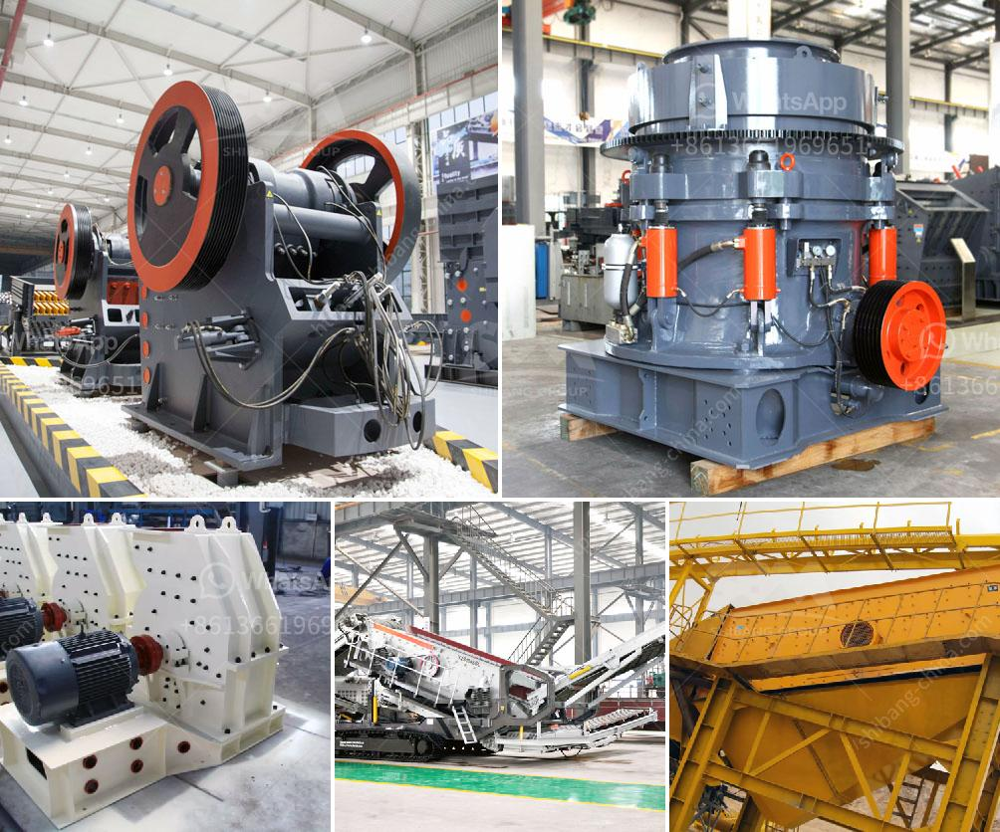

<h3>roller mill manufacturers in nigeria</h3>
Roller mills are industrial machines that are used to break down and process a variety of ingredients in the food, agricultural, and chemical industries. A roller mill can be thought of as a large, heavy-duty grinding machine that makes use of cylindrical rollers to crush and grind material into fine powder. Roller mills have an extensive range of application in various manufacturing and processing industries, including the agricultural sector.

In Nigeria, roller mills are perhaps not as well-known as other types of milling machines, such as hammer mills and ball mills. However, they are widely utilized across numerous industries, including food processing, pharmaceuticals, and minerals processing. Roller mills in Nigeria are used to grind wheat, corn, soybeans, millet, sorghum, and other grains to obtain refined flour and other food ingredients.

One of the leading roller mill manufacturers in Nigeria is Nwaoboshi Nigeria Limited. Founded in 1983, Nwaoboshi specializes in the manufacturing of roller mills, feed mill plants, extruders, and other agricultural equipment. With over 35 years of experience in the industry, Nwaoboshi has established itself as a reliable and reputable name in the Nigerian market.

Another prominent roller mill manufacturer in Nigeria is Nigerian Eagle Flour Mills Limited. Established in 1964, Nigerian Eagle Flour Mills Limited is a subsidiary of Flour Mills of Nigeria Plc. It is one of the largest flour millers in Nigeria and produces various flour products, including wheat flour, semolina, and whole wheat flour. Utilizing roller mills in its production processes, Nigerian Eagle Flour Mills Limited ensures the production of high-quality, nutritious flour products that cater to the needs of consumers across Nigeria.

Lafarge Africa Plc is also a significant player in the roller mill manufacturing industry in Nigeria. Although primarily known for its cement production, Lafarge Africa Plc also manufactures and sells a range of building materials, including precast concrete products, aggregates, and blended cement. Roller mills are used in the production of cement, where they help crush and grind the raw materials to produce the fine powder used in cement manufacturing.

These are just a few examples of roller mill manufacturers in Nigeria; however, there are several others present in the country. With the growing demand for processed food products and the expansion of various manufacturing industries, roller mills play a crucial role in ensuring efficient and high-quality production processes.

It is important to note that roller mills come in different sizes and capacities to suit the specific needs of different industries. Factors such as the desired particle size, processing capacity, and the type of material being processed determine the specific type and size of roller mill required.

In conclusion, roller mills are vital machines used in various manufacturing and processing industries in Nigeria. As the demand for processed food products and other industrial materials increases, roller mill manufacturers play a crucial role in meeting this demand by providing high-quality and efficient milling machines. These manufacturers, such as Nwaoboshi Nigeria Limited, Nigerian Eagle Flour Mills Limited, and Lafarge Africa Plc, are at the forefront of ensuring the availability of roller mills in Nigeria, contributing significantly to the country's industrial growth and development.
<h3>Contact us</h3><ul><li><strong>Whatsapp:&nbsp;<a href="https://wa.me/8613661969651">+8613661969651</a></strong></li><li><a href="https://swt.shibang-china.com/?git&amp;zhl&amp;roller mill manufacturers in nigeria"><strong>Online Service(chat now)</strong></a></li></ul><h3>Related</h3><ul><li><a href='stone crushing equipment available in northern cape.md'>stone crushing equipment available in northern cape</a></li><li><a href='crusher plant equipment supplier in saudi arabia.md'>crusher plant equipment supplier in saudi arabia</a></li><li><a href='mini mobile crusher plant for sale.md'>mini mobile crusher plant for sale</a></li><li><a href='ballast crusher line.md'>ballast crusher line</a></li><li><a href='grinding of calcined gypsum.md'>grinding of calcined gypsum</a></li></ul>