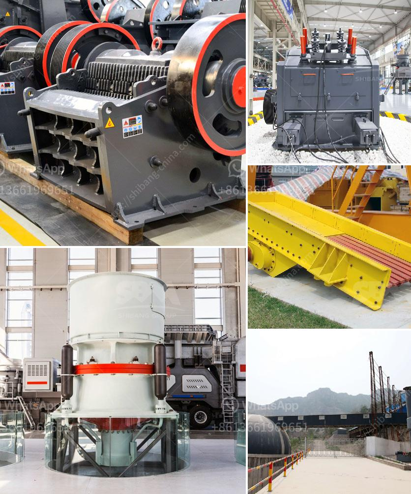

<h3>roller mill nigeria</h3>
Nigeria, a populous country in West Africa, has been witnessing a surge in demand for various food products. Flour, a key ingredient in many Nigerian dishes, is essential in the daily diet of its population. This has created a massive market for flour mills in the country, with one particular type of mill gaining significant traction - the roller mill.

Roller mills are a type of grinding equipment used to grind grains into flour. They consist of a pair of parallel cylindrical rollers that rotate against each other at different speeds. As the grain passes through the gap between the rollers, it undergoes compression and shearing, resulting in the production of fine, uniform flour particles.

The roller mill technology offers several advantages over traditional stone mills that were previously used in Nigeria. Firstly, roller mills are more efficient and capable of producing higher yields. This increased efficiency means that a higher quantity of grain can be processed in a shorter time, leading to higher productivity and profitability for flour mills.

Furthermore, roller mills produce a more consistent and uniform flour compared to stone mills. This is especially important in the Nigerian market, where consumers value the quality and taste of their food. The consistent particle size distribution achieved by roller mills ensures that the flour performs well in various applications, such as making bread, pastries, and other baked goods.

Another advantage of roller mills is their versatility. They are capable of grinding a wide range of grains, including wheat, corn, barley, and rice. This flexibility allows flour mills to cater to diverse customer demands and adapt to changes in the market easily. As Nigeria continues to develop and urbanize, there is a growing demand for specialty flours, such as whole wheat flour, which can be produced using roller mills.

Roller mills also offer improved hygiene and sanitation compared to traditional stone mills. With the use of stainless steel for the rollers and other contact parts, the risk of contamination from stones or debris is minimized. This is particularly important in ensuring the safety and quality of the flour produced, meeting the health and regulatory standards set by the Nigerian authorities.

Despite the numerous advantages roller mills provide, their adoption in the Nigerian market is still in its early stages. Many flour mills in the country still rely on traditional stone mills, which are slower, less efficient, and produce lower quality flour. However, the awareness and demand for roller mills are gradually increasing as millers realize their benefits and the need to modernize their operations.

Some prominent flour mills in Nigeria have already embraced the roller mill technology and are reaping its rewards. These mills are not only meeting the demands of the local market but are also exporting their high-quality flour products to neighboring countries. This demonstrates the tremendous potential that exists for roller mills in Nigeria and the wider West African region.

In conclusion, the roller mill technology presents a lucrative opportunity for flour mills in Nigeria. Its efficiency, consistency, versatility, and improved hygiene make roller mills the ideal solution for meeting the growing demand for flour in the country. As more millers recognize these benefits, roller mills are expected to become the norm, revolutionizing the Nigerian flour industry and positioning it for sustainable growth.
<h3>Contact us</h3><ul><li><strong>Whatsapp:&nbsp;<a href="https://wa.me/8613661969651">+8613661969651</a></strong></li><li><a href="https://swt.shibang-china.com/?git&amp;zhl&amp;roller mill nigeria"><strong>Online Service(chat now)</strong></a></li></ul><h3>Related</h3><ul><li><a href='harga grinder mill.md'>harga grinder mill</a></li><li><a href='raymond mills india.md'>raymond mills india</a></li><li><a href='grinding equipment raymond mill.md'>grinding equipment raymond mill</a></li><li><a href='circuit stone cone crusher plant.md'>circuit stone cone crusher plant</a></li><li><a href='jaw crushers south africa.md'>jaw crushers south africa</a></li></ul>