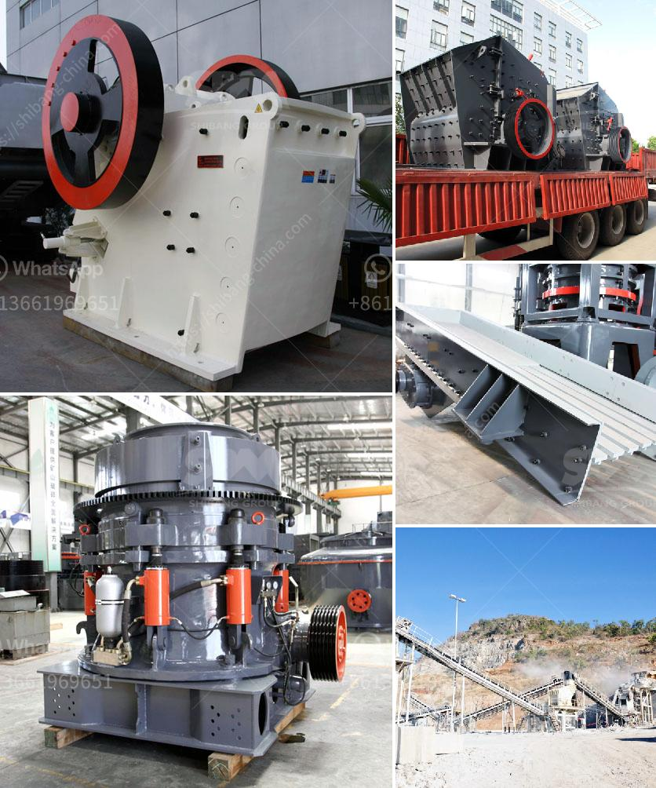

<h3>roller mill suppliers in mexico</h3>
Mexico, with its diverse agricultural and industrial landscape, has experienced rapid growth and development in recent years. As a result, there has been an increasing demand for efficient machinery and equipment to bolster productivity across various sectors. Roller mills, serving as a fundamental processing tool, have become imperative for industries ranging from agriculture to food processing. In this article, we will explore the roller mill suppliers in Mexico that have significantly contributed to streamlining operations and enhancing productivity in these sectors.

Roller mills play a crucial role in the agricultural sector, providing farmers with the necessary equipment to process grains and produce high-quality feed for livestock. These mills help in achieving optimal particle size and consistency for animal feed, leading to better overall digestion and growth of livestock. Furthermore, roller mills can process various types of grains with ease, including corn, wheat, and barley, enabling wider agricultural practices across the country.

One notable supplier in Mexico is Grupo Trimex, a leading manufacturer of roller mills and other agricultural machinery. With a strong emphasis on innovation and quality, Grupo Trimex has established a solid reputation in the industry. Their roller mills are lauded for their robust construction and durability, ensuring long-lasting performance even amidst heavy usage. In addition, Grupo Trimex provides comprehensive support, including technical guidance and after-sales services, ensuring that their customers have a seamless experience.

Another prominent supplier is Molinos Azteca y Juper, a company deeply rooted in the agricultural industry. They specialize in the manufacturing of roller mills tailored to meet the specific needs of their clients. Molinos Azteca y Juper has leveraged advanced technology and expertise to produce highly efficient roller mills that optimize energy consumption and reduce waste. Their commitment to research and development has enabled them to offer cutting-edge machines, further enhancing productivity in the agricultural sector.

Moving beyond agriculture, roller mills have also found extensive applications in the food processing industry. Mexico, being a major producer of corn, relies on roller mills for processing corn into a variety of products, such as masa for tortillas and cornmeal for baking. By employing roller mills, numerous food processing companies in Mexico have streamlined their processes, resulting in improved quality and cost-effectiveness.

One such supplier catering to the food processing industry is Bühler Group, a global leader in roller mill technology. Bühler has a significant presence in Mexico, offering state-of-the-art roller mills that deliver outstanding performance and consistency. Their mills are equipped with cutting-edge automation, allowing for precise control and monitoring of critical parameters. This ensures that food manufacturers in Mexico can achieve desired product quality while maintaining efficiency and consistency throughout their operations.

In conclusion, roller mill suppliers in Mexico have played a crucial role in enhancing productivity and efficiency in the agricultural and industrial sectors. These suppliers, such as Grupo Trimex, Molinos Azteca y Juper, and Bühler Group, have offered innovative and high-quality roller mills tailored to meet the specific needs of their customers. With their superior performance and comprehensive support, these suppliers have become indispensable partners for Mexican farmers and food processors alike. As Mexico continues to advance industrially, the roller mill suppliers are expected to play a pivotal role in meeting the growing demand for efficient machinery, driving economic growth and development in various sectors.
<h3>Contact us</h3><ul><li><strong>Whatsapp:&nbsp;<a href="https://wa.me/8613661969651">+8613661969651</a></strong></li><li><a href="https://swt.shibang-china.com/?git&amp;zhl&amp;roller mill suppliers in mexico"><strong>Online Service(chat now)</strong></a></li></ul><h3>Related</h3><ul><li><a href='marble crushing machinery.md'>marble crushing machinery</a></li><li><a href='two pass roller mill.md'>two pass roller mill</a></li><li><a href='production of barium sulfate main plant equipment.md'>production of barium sulfate main plant equipment</a></li><li><a href='crusher and producton per hour.md'>crusher and producton per hour</a></li><li><a href='hand portable rock crusher.md'>hand portable rock crusher</a></li></ul>