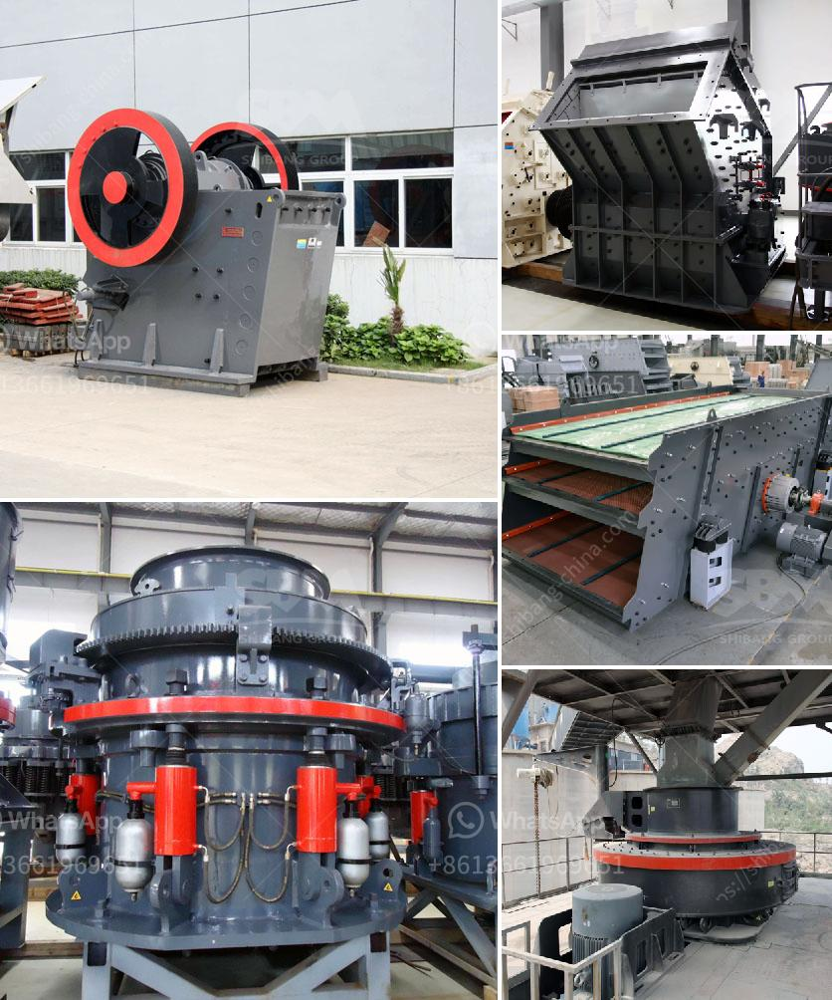

<h3>roller screen for coal</h3>
Roller screens for coal are an innovative solution that aims to enhance the efficiency and productivity of coal mining operations. These screens are designed to separate coal particles of different sizes, allowing for a more precise sorting and grading process. With their robust construction and versatile functionality, roller screens have become a crucial component in modern coal preparation plants.

One of the primary benefits of roller screens is their ability to handle large volumes of coal effectively. They operate by rotating cylindrical drums equipped with strategically placed sieves or perforations. As the coal is fed onto the roller screen, the rotating motion separates the coal particles according to size. This separation process ensures that each particle is directed to the appropriate conveyor or storage unit, optimizing the efficiency of the coal preparation plant.

Roller screens also allow for more accurate grading of the coal. The screens can be customized with different sizes of sieves or perforations, enabling operators to achieve the desired coal particle size distribution. This is particularly essential in power generation plants, where specific coal particle sizes are required for efficient combustion. By accurately grading the coal, roller screens contribute to the overall quality and performance of the coal being processed.

Furthermore, roller screens offer a durable and reliable screening solution. The drums are engineered to withstand the harsh conditions of coal mining, including heavy-duty loads and the abrasiveness of coal particles. They are frequently constructed from high-strength materials such as steel, which ensures longevity and minimizes maintenance needs. This robustness makes roller screens a cost-effective investment for coal companies, as they reduce downtime and repair costs.

Another advantage of roller screens is their adaptability to various coal processing environments. They can be designed to fit into existing coal preparation plants, providing a seamless integration into the production line. Additionally, roller screens can be equipped with various accessories and additions to optimize their performance. For example, the addition of water spray systems can enhance the efficiency of coal washing by removing impurities and improving the overall quality of the coal.

Overall, roller screens for coal offer numerous benefits to coal mining operations. Their ability to handle large volumes of coal efficiently, accurate grading, durability, and adaptability make them a valuable asset in the coal preparation process. Furthermore, roller screens contribute to improved coal quality, leading to better combustion efficiency and reduced environmental impact in power generation plants.

As the demand for coal continues to grow, roller screens provide a solution that enhances productivity, reduces downtime, and improves the overall efficiency of the coal mining industry. With ongoing advancements in technology and design, roller screens are likely to become even more essential in the future, offering enhanced performance and increased sustainability to coal mining operations worldwide.
<h3>Contact us</h3><ul><li><strong>Whatsapp:&nbsp;<a href="https://wa.me/8613661969651">+8613661969651</a></strong></li><li><a href="https://swt.shibang-china.com/?git&amp;zhl&amp;roller screen for coal"><strong>Online Service(chat now)</strong></a></li></ul><h3>Related</h3><ul><li><a href='dolomite crushing machine pdf.md'>dolomite crushing machine pdf</a></li><li><a href='hammer mill prices.md'>hammer mill prices</a></li><li><a href='dolomite crusher manufacture plant.md'>dolomite crusher manufacture plant</a></li><li><a href='stone crusher machine supplier.md'>stone crusher machine supplier</a></li><li><a href='crusher in antioquia stone crusher.md'>crusher in antioquia stone crusher</a></li></ul>