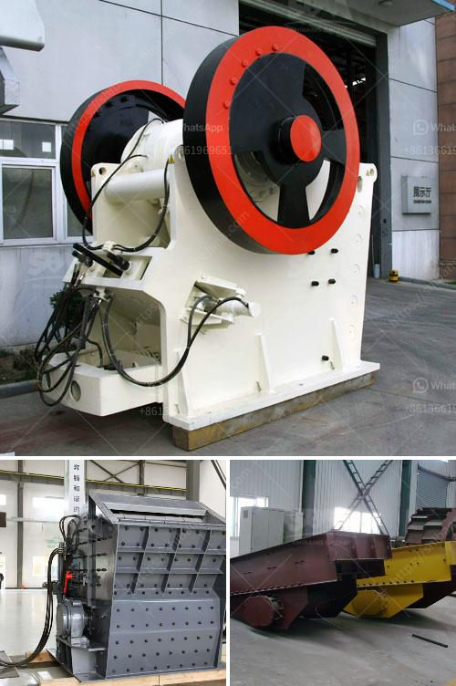

<h3>rubber belt conveyor for sale</h3>
Are you in the manufacturing or distribution industry and in need of a reliable and efficient method of transporting goods? Look no further than a rubber belt conveyor. With its plethora of benefits and versatility, a rubber belt conveyor is an invaluable asset for any business. And today, you're in luck as we bring you some of the best rubber belt conveyors for sale.

One of the primary advantages of a rubber belt conveyor is its ability to move products horizontally, vertically, or at an incline. It offers convenience when it comes to transporting goods between different levels of a facility, eliminating the need for manual labor and enhancing productivity. Whether you need to move packages, raw materials, or finished products, a rubber belt conveyor has got you covered.

Another significant benefit is the strength and durability that a rubber belt conveyor provides. Made with high-quality materials and engineered to withstand heavy loads, these conveyors ensure that your goods are transported safely and efficiently. With a robust build, they require less maintenance and have a longer lifespan, making them a cost-effective investment for your business.

In addition to this, rubber belt conveyors are highly customizable to meet the unique requirements of your operations. From variable speeds to adjustable heights, you can tailor these conveyors specifically to your needs. This adaptability ensures seamless integration into your existing production line, optimizing workflow and enhancing overall efficiency.

If you're in the market for a rubber belt conveyor, you'll be delighted to know that there are various options available for sale. With a range of sizes and load capacities to choose from, you can find the perfect conveyor for your business. However, it's essential to connect with reputable suppliers to ensure quality and reliability.

In conclusion, a rubber belt conveyor is a game-changer for businesses in need of a robust and versatile transportation solution. Investing in a conveyor can revolutionize your operations, streamlining the movement of goods and improving productivity. With a wide range of options available for sale, take the time to research reputable suppliers and find the perfect fit for your business needs. Don't miss out on the opportunity to enhance your business's efficiency and success with a rubber belt conveyor today.
<h3>Contact us</h3><ul><li><strong>Whatsapp:&nbsp;<a href="https://wa.me/8613661969651">+8613661969651</a></strong></li><li><a href="https://swt.shibang-china.com/?git&amp;zhl&amp;rubber belt conveyor for sale"><strong>Online Service(chat now)</strong></a></li></ul><h3>Related</h3><ul><li><a href='mobile gold processing plant south africa.md'>mobile gold processing plant south africa</a></li><li><a href='ball mill hammer mill.md'>ball mill hammer mill</a></li><li><a href='limestone stone making plant.md'>limestone stone making plant</a></li><li><a href='small stone crushers ontario canada.md'>small stone crushers ontario canada</a></li><li><a href='technical specification for ball mill.md'>technical specification for ball mill</a></li></ul>