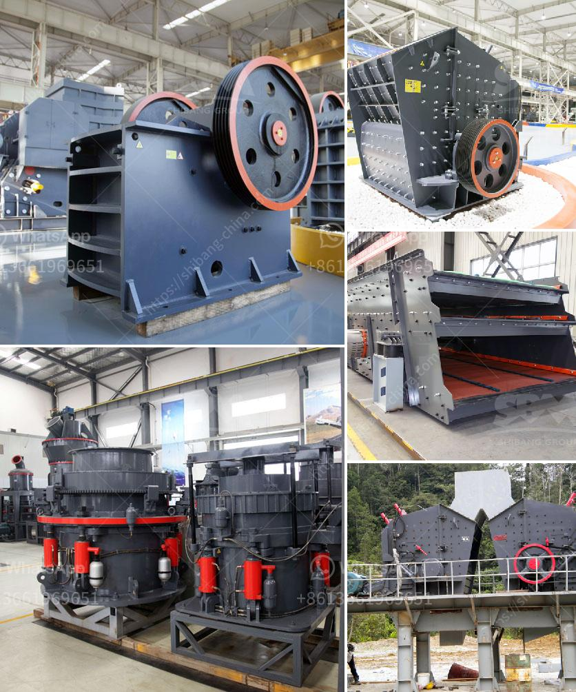

<h3>rubber conveyor belt manufacturers in turkey</h3>
Turkey stands as one of the major players in the global conveyor belt market. As a country that relies heavily on the agricultural and industrial sectors, Turkey has been a hub for conveyor belt manufacturers and suppliers. With the country's diverse geographical landscape, ranging from mountains to farmland, Turkey has an increasing demand for conveyor belts to cater to different industries.

Turkey's conveyor belt industry has evolved over the years, thanks to technological advancements and innovative designs. Today, Turkey is home to numerous manufacturers and suppliers of rubber conveyor belts that can meet the growing demand for industrial equipment and solutions.

One of the key advantages of working with Turkish conveyor belt manufacturers is their commitment to quality and customer satisfaction. The manufacturers in Turkey believe in providing reliable and durable conveyor belts that can withstand heavy loads and harsh environmental conditions. Many manufacturers adhere to international standards such as ISO 9001:2015, ensuring that their products meet the highest quality standards.

The rubber used in conveyor belts produced in Turkey is known for its exceptional strength and longevity. The materials used are resistant to wear and tear, oil, chemicals, and extreme temperatures. This makes them suitable for a wide range of industries, including mining, agriculture, food processing, and manufacturing.

Turkey's conveyor belt manufacturers offer a wide range of conveyor belt types and designs, including flat belts, modular belts, sidewall belts, and heat-resistant belts. These belts are available in various sizes, widths, and thicknesses, providing flexibility for different application requirements. Whether it's a simple conveying system or a complex material handling setup, Turkish manufacturers can provide customized solutions tailored to meet specific needs.

Apart from manufacturing, many Turkish conveyor belt companies also offer installation, maintenance, and after-sales services. This enables customers to have a hassle-free experience throughout the lifecycle of their conveyor belts. Manufacturers often work closely with clients to understand their requirements and provide expert guidance to ensure optimal performance and longevity of the conveyor systems.

Turkey's strategic location between Europe, Asia, and Africa also makes it a preferred choice for global customers. With its well-connected transportation network, manufacturers can efficiently export their products to different parts of the world, providing timely deliveries even for overseas clients.

In conclusion, Turkey has emerged as a reliable source for rubber conveyor belts. The country's conveyor belt manufacturers have gained recognition for their commitment to providing high-quality, durable, and customized solutions. With a wide range of products and services, these manufacturers cater to various industries, driving Turkey's position as a major player in the global conveyor belt market. So, for businesses seeking efficient and reliable conveying solutions, working with rubber conveyor belt manufacturers in Turkey is a valuable choice.
<h3>Contact us</h3><ul><li><strong>Whatsapp:&nbsp;<a href="https://wa.me/8613661969651">+8613661969651</a></strong></li><li><a href="https://swt.shibang-china.com/?git&amp;zhl&amp;rubber conveyor belt manufacturers in turkey"><strong>Online Service(chat now)</strong></a></li></ul><h3>Related</h3><ul><li><a href='how to make limestone powder.md'>how to make limestone powder</a></li><li><a href='gravel making crusher.md'>gravel making crusher</a></li><li><a href='chrome crusher philippines.md'>chrome crusher philippines</a></li><li><a href='iron ore melting plant supplier china.md'>iron ore melting plant supplier china</a></li><li><a href='calcite crusher machine.md'>calcite crusher machine</a></li></ul>