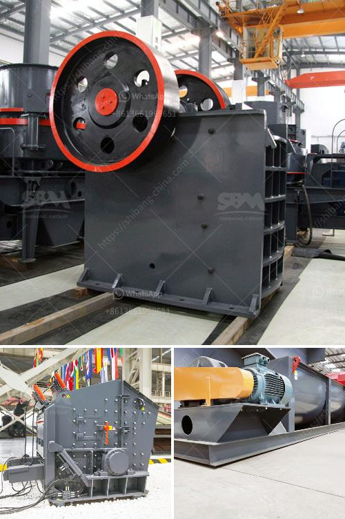

<h3>rubber mill grinder</h3>
Rubber mill grinders are an essential tool in the rubber recycling process. These machines efficiently break down rubber material into smaller, more manageable particles, often referred to as rubber crumb. This crumb can then be used in a variety of applications, such as in the manufacturing of new rubber products or for other industrial purposes.

One of the key advantages of using a rubber mill grinder is its ability to reduce waste. By breaking down rubber material that would otherwise end up in landfills, these machines play a crucial role in sustainable resource management. Moreover, the size of the rubber crumb produced by these grinders can be easily adjusted, making them adaptable for various production needs.

Rubber mill grinders are typically equipped with high-speed rotating blades that cut through the rubber material. The blades are designed to efficiently shred the rubber into fine particles, allowing for further processing and utilization. Additionally, these grinders often feature a screen or mesh, which helps to control the size of the output material.

When choosing a rubber mill grinder, it is important to consider factors such as the desired output size, blade configuration, and overall capacity. Some grinders may be more suited for smaller-scale operations, while others are better equipped to handle larger quantities of rubber material. Additionally, it is crucial to ensure that the machine is built with high-quality materials and meets safety standards to guarantee optimal performance and worker protection.

In conclusion, rubber mill grinders are invaluable machines in the rubber recycling industry. By efficiently breaking down rubber material into smaller particles, they contribute to waste reduction and promote sustainable resource management. As the demand for recycled rubber continues to grow, the importance of these grinders in the rubber recycling process cannot be overstated. Therefore, investing in a reliable and efficient rubber mill grinder is a wise decision for any business in the industry.
<h3>Contact us</h3><ul><li><strong>Whatsapp:&nbsp;<a href="https://wa.me/8613661969651">+8613661969651</a></strong></li><li><a href="https://swt.shibang-china.com/?git&amp;zhl&amp;rubber mill grinder"><strong>Online Service(chat now)</strong></a></li></ul><h3>Related</h3><ul><li><a href='companies that manufacture ball mill.md'>companies that manufacture ball mill</a></li><li><a href='bauxite processing into aluminum.md'>bauxite processing into aluminum</a></li><li><a href='graphite crusher products.md'>graphite crusher products</a></li><li><a href='chrome crusher philippines.md'>chrome crusher philippines</a></li><li><a href='gold separating machine for sale in south africa.md'>gold separating machine for sale in south africa</a></li></ul>