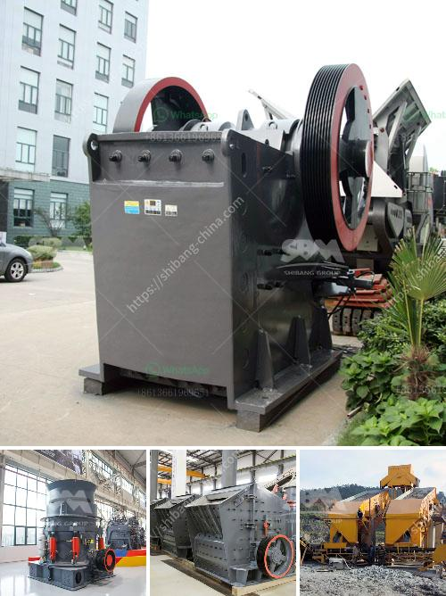

<h3>rubber scrap for sale in uae</h3>
The United Arab Emirates (UAE) has been witnessing significant growth in various industries, leading to a surge in demand for raw materials. One such material that is in high demand is rubber scrap. Rubber scrap refers to the discarded rubber products that can be recycled or repurposed for various applications. This valuable resource can be sourced from various industries, including automotive, manufacturing, construction, and more.

There are several reasons why rubber scrap has gained popularity in the UAE market. Firstly, the recycling and repurposing of rubber scrap helps reduce environmental pollution. By diverting rubber from landfills, businesses can contribute to a more sustainable and eco-friendly future. Secondly, recycled rubber can be used for a wide range of applications, such as sports flooring, rubber mats, playground surfaces, and more. This versatility makes rubber scrap an attractive option for businesses looking to fulfill their raw material requirements.

In the UAE, there are numerous suppliers offering rubber scrap for sale, catering to the growing demand. These suppliers collect discarded rubber from various sources, including industries, construction sites, and even individual households. They then process the rubber scrap through various techniques such as shredding, grinding, and melting to produce high-quality recycled rubber products. These products undergo rigorous quality checks to ensure they meet industry standards.

Businesses in the UAE can benefit greatly from purchasing rubber scrap. Firstly, it helps reduce their production costs as recycled rubber is often less expensive than virgin rubber. Additionally, using recycled rubber showcases a company's commitment to sustainability, which can enhance its brand image and attract environmentally conscious customers.

Moreover, the demand for rubber scrap in the UAE is not limited to local businesses. With its strategic location and excellent infrastructure, the UAE serves as a hub for international trade, making it an ideal destination for rubber scrap buyers from various regions. This presents an opportunity for suppliers to export their recycled rubber products and expand their customer base globally.

In conclusion, rubber scrap for sale in the UAE offers a lucrative opportunity for businesses. Not only does it contribute to environmental sustainability by recycling rubber, but it also provides a cost-effective solution for various industries. Whether it's for local consumption or for international export, the demand for rubber scrap in the UAE market is on the rise. By embracing this trend, businesses can not only meet their raw material needs but also make a positive impact on the environment.
<h3>Contact us</h3><ul><li><strong>Whatsapp:&nbsp;<a href="https://wa.me/8613661969651">+8613661969651</a></strong></li><li><a href="https://swt.shibang-china.com/?git&amp;zhl&amp;rubber scrap for sale in uae"><strong>Online Service(chat now)</strong></a></li></ul><h3>Related</h3><ul><li><a href='zinc crusher machine zimbabwe.md'>zinc crusher machine zimbabwe</a></li><li><a href='list of stone crushers in odisha.md'>list of stone crushers in odisha</a></li><li><a href='alluvial diamond processing plant cost.md'>alluvial diamond processing plant cost</a></li><li><a href='conveyor belts in malaysia.md'>conveyor belts in malaysia</a></li><li><a href='rock crushers manufacturers.md'>rock crushers manufacturers</a></li></ul>