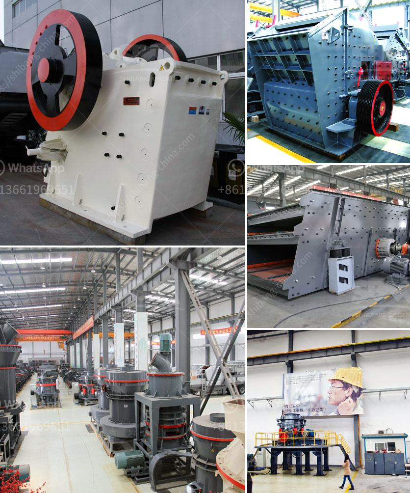

<h3>safety of belt conveyors in hindi</h3>
बड़ी उद्योग या कारख़ानों में भटकाव और माल एक स्थान से दूसरे स्थान पर ले जाने के लिए विभिन्न तकनीकों का उपयोग किया जाता है। इनमें से एक प्रमुख तकनीक है बेल्ट कन्वेयर का उपयोग करके सामग्री को स्थानांतरित करना। यह तकनीक कारख़ाने में समय और कार्यक्षमता को बढ़ाती है, लेकिन क्या यह सुरक्षित है? क्या हम इसका उपयोग करने से पहले उच्चतम सुरक्षा मानकों पर ध्यान दे रहे हैं?

बेल्ट कन्वेयर सुरक्षा अवधारणाओं के पालन पर निर्भर करती है। इसका पूरा प्रयोग करने के लिए, हमें सुनिश्चित करना चाहिए कि उद्यमी मानकों, विनियमों, और नियोजन की पूर्ति करता है। यह तकनीक केवल अनुभवी और प्रशिक्षित कर्मचारियों द्वारा ही इस्तेमाल की जानी चाहिए। प्रश्नों और विपदाओं से बचने के लिए हमें सुनिश्चित करना चाहिए कि सभी कर्मचारी इसे सुरक्षित तरीके से चला रहे हैं।

यदि केवल एक कर्मचारी भी भूल जाए और उचित सुरक्षा प्रतिबंध को ध्यान में न रखें, तो यह बेहद खतरनाक हो सकता है। बड़ी ताकत और गति के कारण, चोट, गहरी घाव, या मौत के अनुभवों की संभावना होती है। इसलिए, हमें चाहिए कि हम अधिक Sanskari और सतर्क बने तथा यह सुनिश्चित करे कि कोई भी गलत कार्यक्रम न करता है और सुरक्षा के नियमों का पालन करता है।

बेल्ट कन्वेयर की जटिलताएं यहां तक कि चोट, उपद्रवी घाव, या मौत की संभावना को भी बढ़ा सकती हैं। बेल्ट कन्वेयर को संचालित करने वाले कर्मचारियों के द्वारा उठाए गए लापरवाह और अप्रभावी नियमों की आदत में सुधार होना चाहिए। और इसके अलावा, यह सुनिश्चित करने के लिए कि सभी प्रशिक्षण प्राप्त कर चक्कर नहीं लगाते, ताकि वे उव्यवस्थित काम कर सकें।

और इसके साथ-साथ, बेल्ट कन्वेयर के निर्माण के दौरान उच्चतम सुरक्षा मानकों का भी ध्यान देना चाहिए। पॉवर सप्लाइ को कम से कम संभावित चोट और ठोस खंडों से अलग रखना चाहिए। बेल्ट कन्वेयर को घातक दुर्घटना में फंसने के बढ़े कतिपय संभावनाओं से बचने के लिए इसे रेलिंग द्वारा सामरिक रूप से सुरक्षित करना चाहिए।

समाप्त करते हुए, बेल्ट कन्वेयर के उपयोग को बढ़ावा देने के लिए, हमें सुनिश्चित करना चाहिए कि हम लगातार सुरक्षा नीतियाँ पूरी करते रहे। इसके उपयोग से पहले हमें एक बेहतर सुरक्षा पदार्थ और अछूते रखने वाले संकल्पों को तलाशना चाहिए, और इसके उपयोग में विपदाओं से बचने के लिए हमेशा सतर्क रहें। हमारी सुरक्षा हमारे हाथ में है, और हमें इसे हमेशा ध्यान में रखना चाहिए।

(प्रविष्टि: इस लेख का माध्यमिक संगच्छध्यम के साथ पीडीएफ और उत्पादन सुरक्षा के लिए साझा किया जा सकता है)
<h3>Contact us</h3><ul><li><strong>Whatsapp:&nbsp;<a href="https://wa.me/8613661969651">+8613661969651</a></strong></li><li><a href="https://swt.shibang-china.com/?git&amp;zhl&amp;safety of belt conveyors in hindi"><strong>Online Service(chat now)</strong></a></li></ul><h3>Related</h3><ul><li><a href='gypsum crushing plant.md'>gypsum crushing plant</a></li><li><a href='standard operating procedure of ball mill.md'>standard operating procedure of ball mill</a></li><li><a href='quartz powder plant nigeria.md'>quartz powder plant nigeria</a></li><li><a href='olx used crusher machines.md'>olx used crusher machines</a></li><li><a href='gold wash plant at south africa gold mine.md'>gold wash plant at south africa gold mine</a></li></ul>