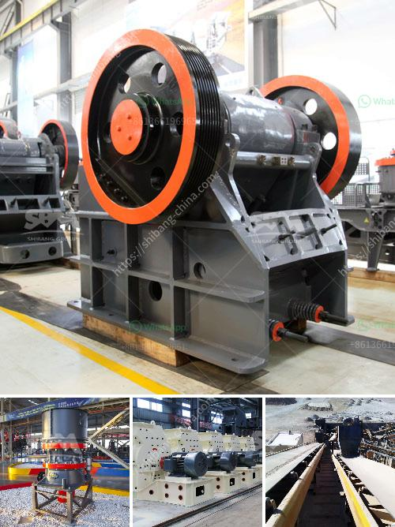

<h3>salt processing plant machinery</h3>
Salt is a mineral that has been a staple in human consumption for centuries. It not only enhances the taste of our food but also acts as a preservative and contributes to our overall health. As the demand for salt continues to rise, the need for efficient and advanced machinery in salt processing plants becomes crucial. These machines play a vital role in the production process, ensuring the highest quality salt reaches consumers worldwide.

One of the most essential machines in a salt processing plant is the salt washing system. This system removes impurities such as dust, dirt, and other foreign particles from raw salt. The salt is first loaded onto a conveyor belt that leads it to a vibrating screen. The screen segregates the larger particles from the finer ones, effectively separating impurities. The finer particles are then washed thoroughly in a series of water sprayers. This process not only cleans the salt but also eliminates any remaining impurities. The salt is then dried using high-speed centrifugal dryers, ensuring it is ready for the next processing step.

Another crucial machine in the salt processing plant is the salt grinding mill. This machine grinds the coarse salt into a finer powder size, suitable for various applications. The grinder consists of a rotating disc with blades that break down the salt crystals into smaller pieces. The resulting salt powder is then collected and stored for packaging or further processing.

In addition to grinding, some salt processing plants also employ salt crushing machines. These machines crush large chunks of salt into smaller pieces, allowing for faster and more efficient processing. The crushed salt is then sieved through a vibrating screen to separate different-sized particles. This process not only enhances the texture of the salt but also facilitates uniform distribution in various food production processes.

As environmental concerns continue to grow, salt processing plants are increasingly adopting eco-friendly machinery. One notable machine is the solar saltworks, which utilizes the sun's heat and evaporation to extract salt from seawater or salt lakes. Unlike traditional salt processing methods, such as mining or underground extraction, solar saltworks significantly reduce the plant's carbon footprint by minimizing energy consumption. This eco-friendly approach not only benefits the environment but also ensures a sustainable salt production process.

Modern salt processing plants also incorporate automated machinery, such as conveyors, robotic arms, and sorting systems. These machines help streamline the production process, reduce human intervention, and improve efficiency. Automation ensures consistent quality by minimizing human error and increasing productivity by optimizing workflow. These advanced technologies have revolutionized salt processing plants, making them more efficient, reliable, and cost-effective.

In conclusion, salt processing plant machinery plays a critical role in meeting the growing demand for salt. From washing and grinding to crushing and automated sorting, this machinery ensures the production of high-quality salt. With the advent of eco-friendly and automated technologies, salt processing plants are becoming more sustainable and efficient. As the importance of salt continues to grow in our daily lives, investing in advanced machinery becomes essential for optimal salt production.
<h3>Contact us</h3><ul><li><strong>Whatsapp:&nbsp;<a href="https://wa.me/8613661969651">+8613661969651</a></strong></li><li><a href="https://swt.shibang-china.com/?git&amp;zhl&amp;salt processing plant machinery"><strong>Online Service(chat now)</strong></a></li></ul><h3>Related</h3><ul><li><a href='cost of 1000 tpd cement plant.md'>cost of 1000 tpd cement plant</a></li><li><a href='conveyor belt manufacturers in pakistan.md'>conveyor belt manufacturers in pakistan</a></li><li><a href='estimated budget for a conveyor belt.md'>estimated budget for a conveyor belt</a></li><li><a href='clay crusher price.md'>clay crusher price</a></li><li><a href='stone crusher plant manufacturers china.md'>stone crusher plant manufacturers china</a></li></ul>