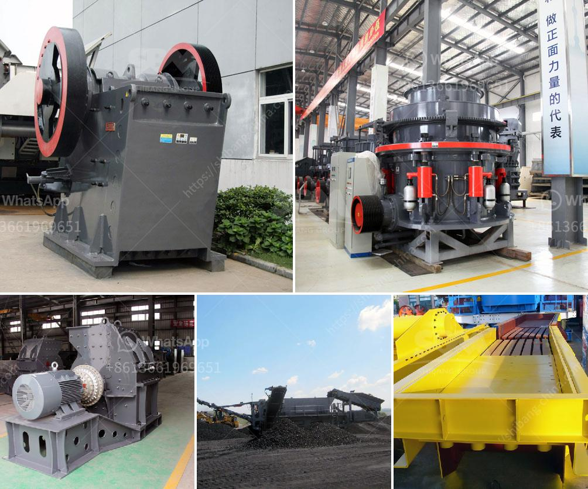

<h3>sand core making machine</h3>
Sand core making machines are essential for the production of sand cores, which are used in various industries such as the automotive, aerospace, and manufacturing sectors. These machines play a crucial role in the production process by creating intricate and complex sand cores that are used as molds for the production of metal or plastic components.

One of the main advantages of using sand cores in the manufacturing process is their ability to create complex internal cavities in castings. These cavities are difficult or sometimes impossible to achieve through other methods. Sand cores are typically made of a mixture of sand, clay, water, and a binder material. The sand core making machine plays a vital role in creating these cores with precision and accuracy.

The sand core making machine is a fully automated system that casts sand cores directly from a CAD model or a 3D scan. The machine can handle different types of sand and create intricate cores without the need for human intervention. This not only accelerates the production process but also ensures consistency and quality in the final product.

The machine consists of several components, including a sand mixer, a binder dosing system, a core shooting machine, and a sand mold. The sand mixer mixes the sand, clay, water, and binder material to create a homogenous mixture. The binder dosing system accurately controls the amount of binder to be added, ensuring the optimal strength of the sand core.

The core shooting machine is responsible for injecting the sand mixture into the mold cavity at high speed and pressure. This ensures a uniform distribution of the sand, resulting in a high-quality core with precise dimensions. After the sand core is formed, it is cooled, solidified, and extracted from the mold.

Sand core making machines are designed to be user-friendly and easy to operate. They can be programmed with specific parameters to create cores of different shapes, sizes, and complexities. The machines also have built-in sensors and cameras that monitor the production process, ensuring that any defects or inconsistencies are detected and corrected.

The advantages of using sand core making machines are numerous. Firstly, they significantly reduce the production time, as the entire process is automated and can run smoothly without interruptions. This allows manufacturers to meet tight deadlines and increase their overall productivity.

Secondly, sand core making machines improve the quality and accuracy of the sand cores. The automated process eliminates human error and ensures consistent production results. This leads to a reduction in product defects and rework, saving both time and money.

Lastly, sand core making machines are environmentally friendly. The machines minimize waste by precisely controlling the amount of sand, water, clay, and binder used in each core. This not only helps to reduce production costs but also minimizes the environmental impact by reducing the amount of waste generated.

In conclusion, sand core making machines are essential tools in the manufacturing process. They enable the production of complex sand cores, which are used as molds for various metal or plastic components. These machines offer numerous benefits, including improved productivity, enhanced quality, and reduced environmental impact. With the advancements in technology, sand core making machines continue to evolve and play a crucial role in the manufacturing industry.
<h3>Contact us</h3><ul><li><strong>Whatsapp:&nbsp;<a href="https://wa.me/8613661969651">+8613661969651</a></strong></li><li><a href="https://swt.shibang-china.com/?git&amp;zhl&amp;sand core making machine"><strong>Online Service(chat now)</strong></a></li></ul><h3>Related</h3><ul><li><a href='crushing plant aggregates in south africa.md'>crushing plant aggregates in south africa</a></li><li><a href='cobalt ore equipments nigeria.md'>cobalt ore equipments nigeria</a></li><li><a href='qustion about ball milling process.md'>qustion about ball milling process</a></li><li><a href='rock crusher price.md'>rock crusher price</a></li><li><a href='price of zenith cone crusher.md'>price of zenith cone crusher</a></li></ul>