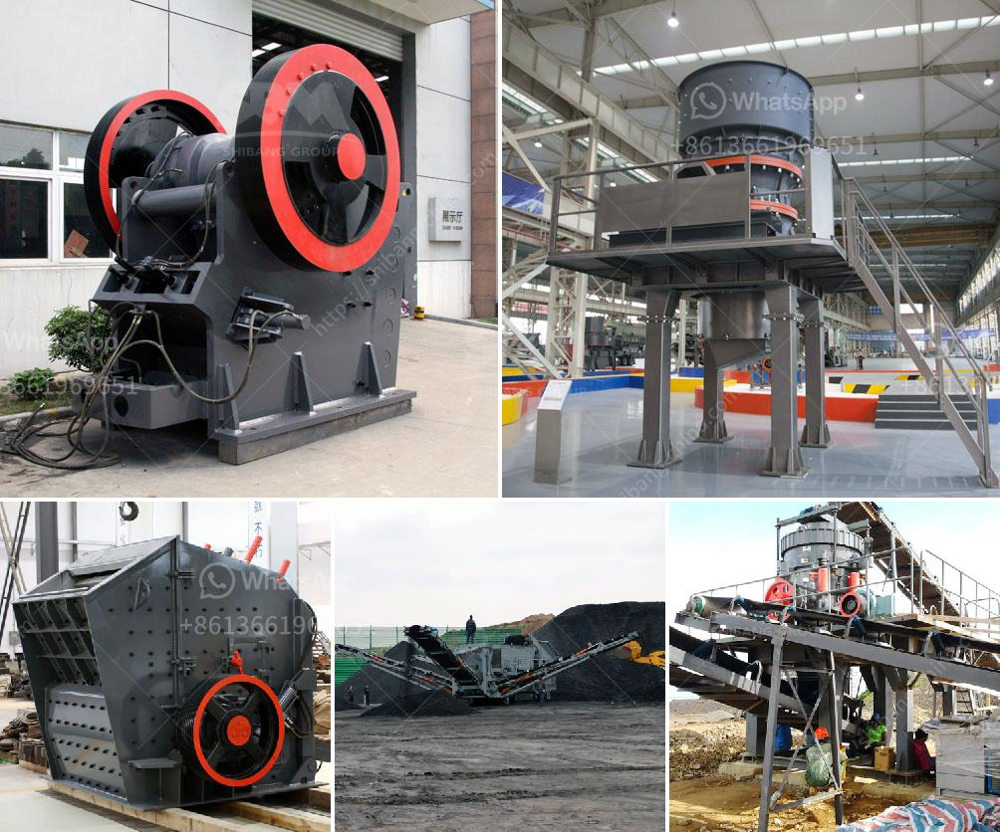

<h3>sand maker machines</h3>
Sand making machines, also known as sand makers or sand crushers, are essential tools for the production of sand and gravel. These machines are used to crush and reshape large rocks and stones into smaller, more manageable pieces. They are commonly used in construction sites, mining operations, and other industries where materials such as sand and gravel are needed.

One of the main advantages of sand maker machines is their ability to produce high-quality sand. By crushing and reshaping rocks and stones, these machines can create sand particles of a consistent size and shape, which is ideal for various applications. The produced sand can be used in concrete production, road construction, and building projects, among others. Its uniformity ensures a smooth and strong finish.

Sand maker machines are also known for their efficiency. These machines are designed to maximize the production of sand while minimizing energy consumption. They use advanced technology and innovative features that allow for a faster and more efficient crushing process. This results in higher productivity and lower operational costs.

Another benefit of sand maker machines is their versatility. These machines can crush a wide range of materials, including limestone, granite, river pebbles, and even metal ores. This versatility makes them suitable for a variety of industries and applications. Whether it's producing sand for a construction project or manufacturing fine aggregates for concrete, sand maker machines can handle the task.

In recent years, improvements in sand maker technology have made these machines even more efficient and reliable. Advanced features such as automatic lubrication systems, hydraulic adjustment mechanisms, and intelligent control systems have enhanced their performance and ease of use. These technological advancements have further contributed to the popularity and demand for sand maker machines in the industry.

In conclusion, sand maker machines are indispensable tools for the production of high-quality sand and gravel. Their ability to crush and reshape rocks and stones efficiently makes them essential in various industries. By combining versatility, efficiency, and advanced technology, these machines are revolutionizing the way sand is produced and utilized.
<h3>Contact us</h3><ul><li><strong>Whatsapp:&nbsp;<a href="https://wa.me/8613661969651">+8613661969651</a></strong></li><li><a href="https://swt.shibang-china.com/?git&amp;zhl&amp;sand maker machines"><strong>Online Service(chat now)</strong></a></li></ul><h3>Related</h3><ul><li><a href='crusher machine in bhutan.md'>crusher machine in bhutan</a></li><li><a href='hammer pulverizer machine price.md'>hammer pulverizer machine price</a></li><li><a href='clay making process nigeria.md'>clay making process nigeria</a></li><li><a href='rubber scrap for sale in uae.md'>rubber scrap for sale in uae</a></li><li><a href='china mini rock crusher.md'>china mini rock crusher</a></li></ul>