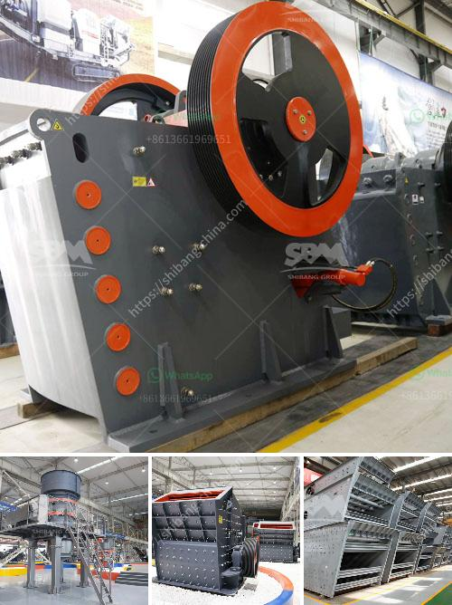

<h3>sand making crusher plant india</h3>
India is a land known for its diverse landscapes and rich cultural heritage. However, it is also a country facing various challenges, one of which is the scarcity of sand. With rapid urbanization and infrastructure development, the demand for sand has skyrocketed over the years. This has led to excessive sand mining and depletion of riverbeds, causing environmental degradation and even displacement of local communities.

To address this issue, the Indian government has taken several initiatives to promote sustainable alternatives to natural sand. One such solution is the establishment of sand making crusher plants. These plants are equipped with specialized crushing equipment that crushes stones into fine aggregates used for construction purposes.

Sand making crusher plants not only help in meeting the increasing demand for sand but also ensure that the sand produced is of high quality and meets the required standards. The crushed stones are further processed by several stages of crushing and screening to produce the desired sand size.

The use of sand making crusher plants in India has made it possible to produce artificial sand at a much cheaper cost than traditional sand. The artificial sand is produced by crushing rocks and stones to create sand-sized particles. This sand is used as building material for several construction projects, such as roads, bridges, buildings, and canals.

Moreover, these crusher plants also help in reducing the environmental impact caused by excessive sand mining. By using artificial sand, the demand for natural sand is reduced, thereby preserving the fragile ecosystems of rivers and preventing further degradation of the environment.

Sand making crusher plants in India are now being widely adopted by construction companies to meet their sand requirements and contribute to sustainable development. With the government's focus on infrastructure development and the need for sustainable alternatives, the demand for sand making crusher plants is expected to increase in the coming years.

In conclusion, sand making crusher plants play a crucial role in addressing the scarcity of sand in India. These plants not only provide a sustainable alternative to natural sand but also contribute to environmental preservation. By adopting such solutions, India can meet its growing demand for sand while ensuring the well-being of its ecosystems and local communities.
<h3>Contact us</h3><ul><li><strong>Whatsapp:&nbsp;<a href="https://wa.me/8613661969651">+8613661969651</a></strong></li><li><a href="https://swt.shibang-china.com/?git&amp;zhl&amp;sand making crusher plant india"><strong>Online Service(chat now)</strong></a></li></ul><h3>Related</h3><ul><li><a href='clay crusher machine in india.md'>clay crusher machine in india</a></li><li><a href='processing of cement crusher.md'>processing of cement crusher</a></li><li><a href='the company mines limestone in ethiopia.md'>the company mines limestone in ethiopia</a></li><li><a href='mineral plant bauxite ore crushing plant.md'>mineral plant bauxite ore crushing plant</a></li><li><a href='costs of a grinding mill.md'>costs of a grinding mill</a></li></ul>