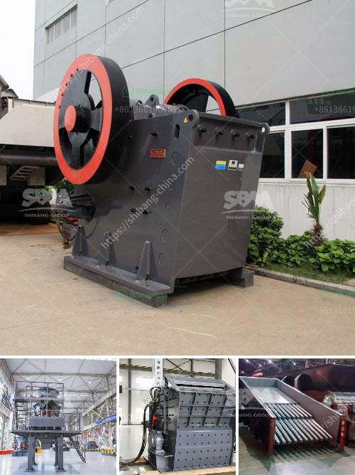

<h3>sand making machine application</h3>
The sand making machine, also known as sand maker, has become a key equipment in the sand making industry. With the development of construction and the increasing demand for sand and gravel, the application of sand making machine is becoming more and more extensive.

The sand making machine is widely used in various ores, highways, railways, bridges, municipal engineering, and other industries. It has unique structural design, high production efficiency, convenient operation, and maintenance. The finished product has uniform particle size and good particle shape, which can greatly meet the demand for sand and gravel aggregates in the construction industry.

One of the main applications of sand making machines is the production of artificial sand. Artificial sand is processed from various rocks or construction waste, and the particle size is uniform and has a beautiful appearance. It is an important raw material for construction industries such as roads, bridges, and buildings. Moreover, the artificial sand produced by the sand making machine has better quality compared with natural sand, and it can reduce environmental pollution caused by natural sand mining.

In addition to artificial sand, the sand making machine is also used to process raw materials such as granite, basalt, limestone, river pebble, cement clinker, quartz stone, iron ore, bauxite, and other minerals. These raw materials are processed into sand and gravel aggregates of different sizes, which are widely used in various construction projects, such as highways, high-speed railways, bridges, airports, and wharves.

The sand making machine has a wide range of applications in the construction industry. For example, in the concrete production process, the artificial sand produced by the sand making machine can replace natural sand to meet the requirements of strength and durability. In the asphalt mixing station, the sand making machine can produce high-quality sand and gravel aggregates, which can improve the overall performance of the asphalt mixture.

Furthermore, the sand making machine is also used in the mining industry. Many mining companies use sand making machines to produce sand and gravel aggregates, which are widely used in various mining projects, such as underground mines, open-pit mines, and ore dressing plants. The sand making machine can process various ores and rocks, such as granite, quartz stone, river pebble, limestone, and so on, to produce high-quality sand and gravel aggregates.

In conclusion, the sand making machine has a wide range of applications in the construction and mining industries. It can process various raw materials into high-quality sand and gravel aggregates, which are widely used in the construction of roads, bridges, buildings, and other projects. With the development of technology, sand making machines will continue to improve in terms of production efficiency, automation, and environmental protection, and further promote the development of the construction industry.
<h3>Contact us</h3><ul><li><strong>Whatsapp:&nbsp;<a href="https://wa.me/8613661969651">+8613661969651</a></strong></li><li><a href="https://swt.shibang-china.com/?git&amp;zhl&amp;sand making machine application"><strong>Online Service(chat now)</strong></a></li></ul><h3>Related</h3><ul><li><a href='small ball mill for sale.md'>small ball mill for sale</a></li><li><a href='mill ball grinding ball mills.md'>mill ball grinding ball mills</a></li><li><a href='complete rock crusher machine prices in pakistan.md'>complete rock crusher machine prices in pakistan</a></li><li><a href='100 per ton coal crush and screen plant.md'>100 per ton coal crush and screen plant</a></li><li><a href='calcium ball mill.md'>calcium ball mill</a></li></ul>