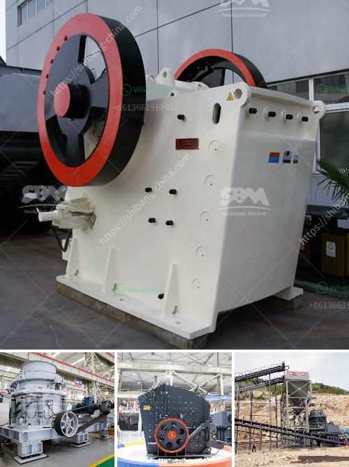

<h3>sand making machine from china</h3>
The demand for sand in the construction industry has seen a significant increase over the years due to rapid urbanization and infrastructure development. To meet this demand, sand making machines have become indispensable equipment in the production of sand. Among the various options available in the market, the sand making machines from China have gained immense popularity due to their high efficiency and advanced technology. Let us delve deeper into the features and benefits of sand making machines from China.

One of the key features of sand making machines from China is their ability to produce high-quality sand with excellent gradation. These machines are equipped with advanced technology and use a combination of impact crushing and stone-on-stone crushing methods to produce sand particles that are uniform in shape and size. This ensures that the sand meets the required specifications and enhances the overall strength and durability of the construction projects.

Another notable feature of sand making machines from China is their energy-saving capabilities. These machines are designed with high-efficiency motors and use advanced technology to reduce power consumption during the sand production process. This not only helps in reducing operational costs but also contributes to environmental sustainability by minimizing energy consumption and carbon footprint.

The sand making machines from China are also known for their low maintenance requirements and long service life. These machines are manufactured using high-quality materials and are subjected to stringent quality control measures to ensure their durability and reliability. They are designed with easy-to-replace wear parts, which reduces downtime for maintenance and repairs, resulting in increased productivity and profitability for the construction industry.

Additionally, sand making machines from China are highly versatile and can be used for various applications apart from sand production. They can be used to crush and shape different materials such as limestone, granite, basalt, and river pebbles to produce high-quality aggregates for concrete production. This versatility makes these machines suitable for a wide range of construction projects, including road construction, building construction, and concrete production.

Furthermore, sand making machines from China have a user-friendly design and are equipped with intelligent control systems. These machines are designed with a touch screen interface and advanced automation features that allow operators to adjust the parameters and monitor the production process easily. The intelligent control systems also provide real-time data, ensuring optimal performance and efficient operation of the machines.

In conclusion, the sand making machines from China have revolutionized the construction industry by providing a reliable and efficient solution for sand production. These machines boast advanced technology, high efficiency, and energy-saving capabilities, making them a preferred choice for construction companies worldwide. With their ability to produce high-quality sand, low maintenance requirements, and versatility, the sand making machines from China are undoubtedly a game-changer in the construction industry.
<h3>Contact us</h3><ul><li><strong>Whatsapp:&nbsp;<a href="https://wa.me/8613661969651">+8613661969651</a></strong></li><li><a href="https://swt.shibang-china.com/?git&amp;zhl&amp;sand making machine from china"><strong>Online Service(chat now)</strong></a></li></ul><h3>Related</h3><ul><li><a href='business plan on manganese ore mining.md'>business plan on manganese ore mining</a></li><li><a href='mobile crusher wanted for rent in johor.md'>mobile crusher wanted for rent in johor</a></li><li><a href='hand portable rock crusher.md'>hand portable rock crusher</a></li><li><a href='stone crusher manufacturers in ludhiana.md'>stone crusher manufacturers in ludhiana</a></li><li><a href='ecuador balls for crushing mill.md'>ecuador balls for crushing mill</a></li></ul>