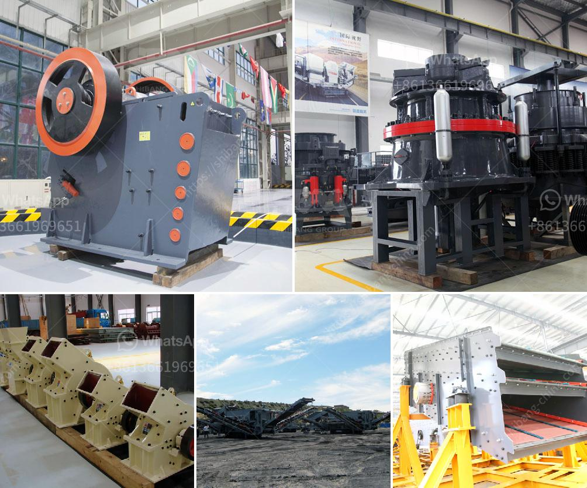

<h3>sand making machine zenith</h3>
The sand making machine has become one of the most sought-after machines in the mining industry. With the continuous development of infrastructure construction and the increasing demand for sand, natural sand resources are rapidly being depleted. Therefore, in order to meet the market demand, the sand making machine has become an effective way to solve the shortage of natural sand.

Zenith, as a professional sand making machine manufacturer, has been devoted to producing high-quality sand making machines for years. Their sand making machine is equipped with advanced technology and is capable of producing high-quality artificial sand, with excellent grain shape and good particle size distribution. It is widely used in various industries such as mining, building materials, metallurgy, and chemical engineering.

The sand making machine from Zenith has many advantages. Firstly, it uses a deep cavity impeller design, which ensures the material throughput and improves the efficiency of crushing. Secondly, the sand making machine has a unique hydraulic device, which allows for easy maintenance and adjustment. Thirdly, it adopts a sophisticated multi-point lubrication system, ensuring the bearings’ heat dissipation and extending their service life. Moreover, the sand making machine is made of high-quality wear-resistant materials, which greatly reduces the wear and tear on its parts.

In addition, the sand making machine from Zenith has a wide range of applications. It can process various materials such as granite, limestone, basalt, pebbles, etc., and produce high-quality artificial sand with good particle size and shape. It is widely used in the construction industry, highway construction, and railway construction.

In conclusion, the sand making machine from Zenith is a reliable and efficient machine for producing artificial sand. With its advanced technology, superior performance, and wide application range, it has become the top choice for many mining companies. If you are in need of a sand making machine, Zenith is definitely a brand worth considering.
<h3>Contact us</h3><ul><li><strong>Whatsapp:&nbsp;<a href="https://wa.me/8613661969651">+8613661969651</a></strong></li><li><a href="https://swt.shibang-china.com/?git&amp;zhl&amp;sand making machine zenith"><strong>Online Service(chat now)</strong></a></li></ul><h3>Related</h3><ul><li><a href='stone hammer mill machine.md'>stone hammer mill machine</a></li><li><a href='hammer crusher machine in malaysia.md'>hammer crusher machine in malaysia</a></li><li><a href='bentonite grinding project.md'>bentonite grinding project</a></li><li><a href='used ultra fine wet grinding mill gold ore.md'>used ultra fine wet grinding mill gold ore</a></li><li><a href='cement boll mill grinding media charging formula.md'>cement boll mill grinding media charging formula</a></li></ul>