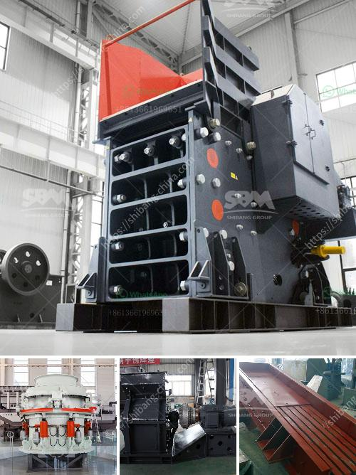

<h3>sand mining equipment manufacturers in south africa</h3>
Sand is a crucial substance used in construction and the extraction of minerals. The demand for sand has surged over the past decade, resulting in excessive mining of this valuable resource. The extraction of sand from beaches or rivers has doubled since the year 2000, mainly due to the booming construction industry. This has led to a surge in the need for sand mining equipment, particularly in countries where the demand for sand far exceeds the available supply.

South Africa is fortunate to have natural significant reserves of limestone. The limestone quarries have valuable resources which are used in the production of many products. This means this is good opportunity for employment creation. Quarries that are no longer of use can be turned into an entertainment area, where people can do ‘rock climbing’. On the other hand, these quarries are large and visible. If not managed properly, they can disfigure the local environment and cause pollution which is hazardous to the environment.

People have been extracting minerals, particularly sand, since the late 18th century in South Africa. Quarries are present in all the provinces and boost local economies. Sand plays a vital role in many materials used in construction, such as concrete, asphalt, bricks, mortar, plaster, cement, and more. In lesser amounts, sand is also used in land reclamation, shore protection, and dams. It is used in the production of glass and electronics.

Statistics South Africa (StatsSA) estimates that sand and gravel mining contributes about 0.2% to the GDP of the country. However, it is important to note that these statistics only represent formaldocumented mining operations. The number of artisanal or informal miners is not included in these figures. These miners are also active in the sand mining sector, contributing significantly to the local economy and providing employment to many people.

The demand for sand mining equipment is growing steadily, and in particular, the South African construction industry is experiencing significant growth. With the country's expanding infrastructure, there is a need for sand mining equipment manufacturers to produce more machines to meet this demand.

Sand mining equipment manufacturers in South Africa work tirelessly to support this burgeoning industry by keeping the standards of construction and manufacturing in South Africa high. They also provide training to artists and engineers they employ in order to ensure equipment performance and safety standards are met for continued use.

With so many sand mining equipment manufacturers in South Africa, it is a daunting task to find the right one. The following tips should be considered before purchasing equipment:

1. Execute a detailed research on equipment specifications and safety features offered by various manufacturers.

5. Read online reviews and gather feedback from other customers who have purchased equipment from the manufacturer.

In conclusion, sand mining equipment plays a crucial role in supporting the South African construction industry. Sand is a critical substance used for numerous construction projects, and manufacturers have been working diligently to meet the growing demand for mining equipment. With their extensive range of high-quality products, these manufacturers continue to make a positive impact on the industry, ensuring that sand mining can be done responsibly and sustainably.
<h3>Contact us</h3><ul><li><strong>Whatsapp:&nbsp;<a href="https://wa.me/8613661969651">+8613661969651</a></strong></li><li><a href="https://swt.shibang-china.com/?git&amp;zhl&amp;sand mining equipment manufacturers in south africa"><strong>Online Service(chat now)</strong></a></li></ul><h3>Related</h3><ul><li><a href='used crusher rock mining germany.md'>used crusher rock mining germany</a></li><li><a href='difference between hp cone crusher.md'>difference between hp cone crusher</a></li><li><a href='mobile crusher on rent in chennai.md'>mobile crusher on rent in chennai</a></li><li><a href='raymond mills mexico.md'>raymond mills mexico</a></li><li><a href='floating processing mining plants.md'>floating processing mining plants</a></li></ul>