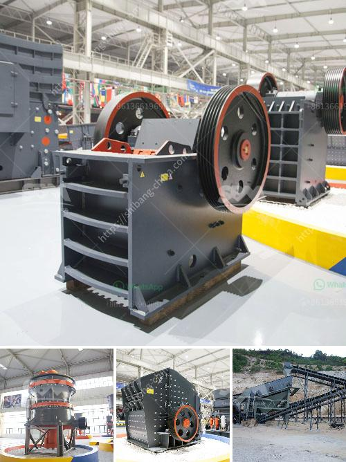

<h3>sand mining for construction in equatorial guinea</h3>
Sand mining for construction is an essential but often overlooked aspect of development in Equatorial Guinea. As one of the fastest-growing economies in Africa, Equatorial Guinea is witnessing an increasing demand for infrastructure, housing, and commercial projects. Sand, being a key ingredient in construction, is extracted from riverbeds, beaches, and other sources to meet this demand.

However, the rapid pace of sand mining in Equatorial Guinea raises concerns about its environmental and social impacts. Unregulated sand extraction can lead to the erosion of riverbeds and coastal areas, causing ecological imbalance and loss of biodiversity. Moreover, the extraction process involves dredging or digging, which can disrupt aquatic ecosystems and affect marine life.

In addition to environmental concerns, sand mining can also have social implications. Local communities heavily rely on rivers and beaches for their livelihoods, particularly through fishing and tourism. The extraction of sand can disrupt these industries, impacting the income and wellbeing of the local population. Furthermore, sand mining can lead to land degradation and erosion, increasing the vulnerability of coastal communities to natural disasters such as flooding and erosion.

To address these issues, Equatorial Guinea must adopt sustainable practices in sand mining. A comprehensive regulatory framework should be established to manage the extraction process, including guidelines for responsible and environmentally friendly methods. Additionally, proper environmental impact assessments should be conducted before granting permits for sand mining operations.

Moreover, alternative sources of construction materials should be explored to reduce the reliance on sand. For example, recycled materials and innovative construction techniques could be employed to minimize the need for excessive sand extraction.

Lastly, raising awareness among the public and stakeholders is crucial to promote sustainable sand mining practices. Educational campaigns on the importance of preserving natural resources and the potential consequences of uncontrolled sand extraction can help generate support for sustainable development.

Sand mining for construction in Equatorial Guinea is undoubtedly necessary for the country's growth and development. However, it is imperative to strike a balance between meeting the demands of infrastructure and preserving the environment. By adopting sustainable practices and ensuring responsible sand mining, Equatorial Guinea can achieve development while safeguarding its natural resources for future generations.
<h3>Contact us</h3><ul><li><strong>Whatsapp:&nbsp;<a href="https://wa.me/8613661969651">+8613661969651</a></strong></li><li><a href="https://swt.shibang-china.com/?git&amp;zhl&amp;sand mining for construction in equatorial guinea"><strong>Online Service(chat now)</strong></a></li></ul><h3>Related</h3><ul><li><a href='ultra fine grinder mill.md'>ultra fine grinder mill</a></li><li><a href='stone crusher in himachal pradesh.md'>stone crusher in himachal pradesh</a></li><li><a href='jaw impact crusher poland.md'>jaw impact crusher poland</a></li><li><a href='gold separating machine for sale in south africa.md'>gold separating machine for sale in south africa</a></li><li><a href='manganese processing plant in south africa.md'>manganese processing plant in south africa</a></li></ul>