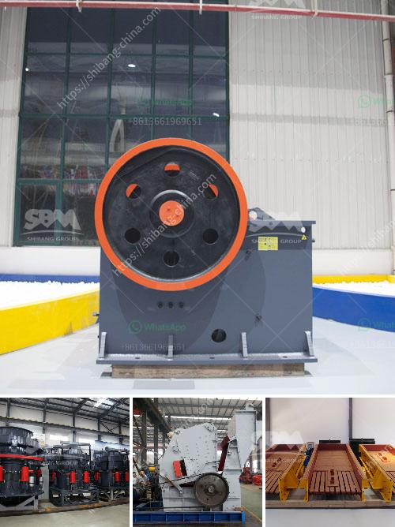

<h3>sand quarry plant</h3>
Sand quarry plant is the ideal equipment for sand making and building stones reshaping. The high efficiency sand quarry plant ensures that the needed capacity is achieved with lower energy consumption. The sand quarry plant represents a guaranteed, state-of-the-art commitment to crushing know-how and quality. Zenith's new generation sand quarry plant consist of vibrating feeders, primary crushers, secondary crushers, vibrating screens, conveyor belts, sand washers, electric control systems and other equipment. The productivity of the sand quarry plant can be designed and adjusted according to customers’ specific requirements.

The process of sand quarry plant starts with the extraction of sand from the ground. After sand is extracted, it needs to pass through a series of crushing and screening stages to be transformed into quality sand products. The first stage of the sand quarry plant involves a primary crusher that breaks down large, oversize rocks. Zenith’s primary crusher processes rocks up to one meter in size to a more manageable size of 20 centimeters. The secondary crusher further reduces the size of the rocks to produce smaller stone particles.

After the primary and secondary crushing stages, the sand quarry plant utilizes vibrating screens to sort and separate the crushed materials into different size fractions. These screens have a triple deck design that allows efficient grading of the sand particles. The undersized material from the screens is sent to a sand washer to remove any unwanted impurities, ensuring that the final sand product meets the required specifications. The sand washer uses water to wash the sand and recover the fine sand lost during the process, resulting in a higher quality end product.

The sand quarry plant also includes a conveyor belt system that transports the crushed materials from one processing stage to another. The conveyor belts are designed to handle bulk materials and ensure smooth, continuous operation of the plant. The electric control system of the sand quarry plant allows easy monitoring and control of the entire production process. It also enables operators to adjust the settings of the plant to achieve the desired output and product quality.

In conclusion, the sand quarry plant plays a crucial role in the construction industry by providing high-quality sand for various applications. With its efficient crushing and screening capabilities, the plant ensures that the extracted sand meets the required specifications and is suitable for use in construction projects. The advanced equipment and technology used in the sand quarry plant enable higher productivity and reduced energy consumption, resulting in cost savings for the operators. The sand quarry plant is a valuable asset for any construction project, providing a reliable supply of quality sand to meet the demands of the industry.
<h3>Contact us</h3><ul><li><strong>Whatsapp:&nbsp;<a href="https://wa.me/8613661969651">+8613661969651</a></strong></li><li><a href="https://swt.shibang-china.com/?git&amp;zhl&amp;sand quarry plant"><strong>Online Service(chat now)</strong></a></li></ul><h3>Related</h3><ul><li><a href='crushers and wash plant processes.md'>crushers and wash plant processes</a></li><li><a href='roller screen for coal.md'>roller screen for coal</a></li><li><a href='gravel cone crusher for sale.md'>gravel cone crusher for sale</a></li><li><a href='market analysis of stone crusher.md'>market analysis of stone crusher</a></li><li><a href='china vertical roller mill prices.md'>china vertical roller mill prices</a></li></ul>