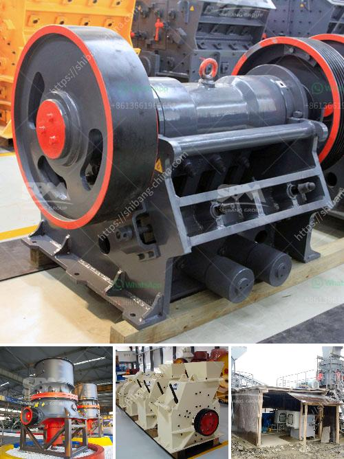

<h3>sand screening machines in south africa</h3>
Sand screening machines are crucial in construction and mining industries. Sand is essential for the production of concrete and asphalt, making it a vital resource for the construction sector. With rapid urbanization and infrastructure development, the demand for sand is constantly increasing. To meet these demands, efficient sand screening machines are necessary.

In South Africa, the sand screening machine is widely used in the construction industry, especially in the production of concrete and asphalt. The sand screening machine is also known as a sieving machine, which separates materials into different sizes. It can be used to classify sand and gravel, soil, and other materials to create different grading specifications.

The machines are commonly used in urban construction sites to process and screen waste, demolitions, and construction waste. By recycling the materials from these sites, the sand screening machines contribute to reducing waste and protecting the environment. Additionally, the machines can be used in mines to separate valuable minerals from unwanted rocks, improving the efficiency of mining operations.

One of the primary benefits of sand screening machines is their ability to save time and labor. Traditionally, the screening process was done manually, which was both time-consuming and tiring. However, with the introduction of sand screening machines, the process is automated and requires minimal human intervention. This not only saves time but also reduces the chances of errors during the screening process.

Furthermore, sand screening machines are highly customizable and can be designed to fit different construction and mining requirements. They come in various sizes and configurations, allowing them to be used in various applications. Additionally, manufacturers offer the machines in both stationary and mobile options, making them suitable for different worksites.

In conclusion, sand screening machines play a vital role in the construction and mining industries in South Africa. The machines facilitate the processing and separation of materials, saving time, labor, and reducing waste. With their customizable options, these machines contribute to the efficient production of concrete, asphalt, and mining operations. As the demand for sand continues to rise, investing in reliable sand screening machines becomes essential for construction and mining companies.
<h3>Contact us</h3><ul><li><strong>Whatsapp:&nbsp;<a href="https://wa.me/8613661969651">+8613661969651</a></strong></li><li><a href="https://swt.shibang-china.com/?git&amp;zhl&amp;sand screening machines in south africa"><strong>Online Service(chat now)</strong></a></li></ul><h3>Related</h3><ul><li><a href='jaw crusher philippines 50 tons per day.md'>jaw crusher philippines 50 tons per day</a></li><li><a href='circuit stone cone crusher plant.md'>circuit stone cone crusher plant</a></li><li><a href='nigeria cone crusher.md'>nigeria cone crusher</a></li><li><a href='iron ore pelletisation plant china.md'>iron ore pelletisation plant china</a></li><li><a href='slag grinding plant.md'>slag grinding plant</a></li></ul>