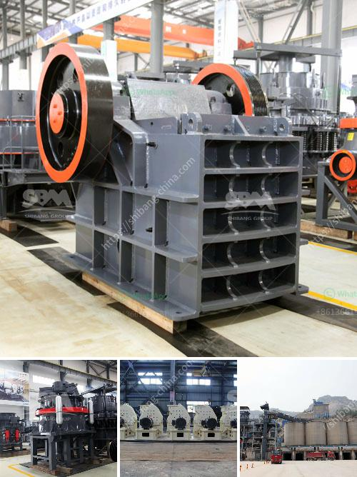

<h3>saudi arabia crusher plant</h3>
Saudi Arabia is well-known for its vast oil reserves, but it is also a hub for a thriving mining industry. With rich deposits of various minerals, including bauxite, copper, gold, iron, lead, silver, tin and non-metallic minerals, Saudi Arabia offers a variety of opportunities for mining companies. Hence, it is no surprise that the country is an attractive destination for various mining equipment manufacturers looking to supply their products to the growing Saudi Arabian market.

Crusher plants are widely used in mineral mining and processing, construction, water conservancy, metallurgy, and other industries. In Saudi Arabia, there are numerous crusher plants that are operating successfully. Some of them have been in the business for decades, while others are starting to gain prominence.

One of these companies is Abdullah A.M. Alkhodari Sons Company (KAAS), a Saudi-based construction firm. KAAS operates a large-scale crusher plant situated in Al Khobar, Saudi Arabia. The plant's location makes it easily accessible to regional markets, as well as strategically positioned to cater to the needs of the region's construction industry.

With a capacity of crushing 1,000 tons of rock per hour, KAAS's crusher plant plays a key role in ensuring the availability of aggregates required for various construction projects. The aggregates produced by the plant are used in the construction of roads, bridges, buildings, and other infrastructure projects across Saudi Arabia.

In addition, the plant employs advanced technology, ensuring efficient and high-quality production. This includes state-of-the-art equipment such as jaw crushers, impact crushers, vibrating screens, and conveyors. These machines work together to process various materials and produce the desired output, contributing to the growth of Saudi Arabia's construction industry.

KAAS's crusher plant complies with all local regulations and international standards, ensuring the safety of its employees and the environment. The company also adopts sustainable practices, minimizing its impact on the environment through efficient resource consumption and waste management.

Overall, crusher plants in Saudi Arabia play a crucial role in the construction industry, providing the necessary aggregates for infrastructure development. With the presence of such plants, the country can effectively meet the growing demand for construction materials and contribute to its economic growth.
<h3>Contact us</h3><ul><li><strong>Whatsapp:&nbsp;<a href="https://wa.me/8613661969651">+8613661969651</a></strong></li><li><a href="https://swt.shibang-china.com/?git&amp;zhl&amp;saudi arabia crusher plant"><strong>Online Service(chat now)</strong></a></li></ul><h3>Related</h3><ul><li><a href='ball milling grinding machine in namibia.md'>ball milling grinding machine in namibia</a></li><li><a href='crushing companies in the usa.md'>crushing companies in the usa</a></li><li><a href='sell stone crusher crushing plant feeder screen conveyors.md'>sell stone crusher crushing plant feeder screen conveyors</a></li><li><a href='complete aggregate crushing plant in usa.md'>complete aggregate crushing plant in usa</a></li><li><a href='small rotary burner for sale used in us.md'>small rotary burner for sale used in us</a></li></ul>