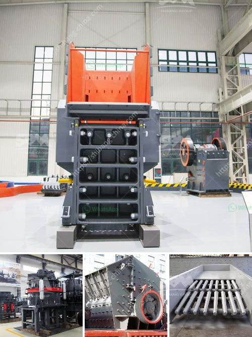

<h3>screen clay from limestone rock</h3>
Limestone, a sedimentary rock composed mainly of calcium carbonate, is not only widely used in construction but also has various industrial applications. One such application is in the production of clay screens. Clay screens are essential in several industries, ranging from construction to ceramics, as they help remove impurities and contaminants from raw materials. The process of screening clay from limestone rock is an important step in ensuring the quality and purity of the clay for its subsequent use.

To screen clay from limestone rock, several steps need to be followed. Firstly, the limestone rock is extracted from quarries and undergoes crushing and grinding processes to reduce it to a desirable size. The crushed limestone is then mixed with water to form a slurry. This slurry is then poured onto a screen, typically made of a fine mesh material, such as stainless steel, which allows the water to drain through while retaining the clay particles.

As the water drains through the screen, the clay particles begin to accumulate on the surface, forming a thick layer. This layer can be further separated and dried to obtain pure clay. The drying process may involve exposing the clay to heat or air-drying it, depending on its subsequent use. Once the clay is dry, it can be further processed and refined to meet specific requirements before being used in various industries.

Screening clay from limestone rock offers numerous benefits. Firstly, it ensures the removal of impurities and contaminants that may be present in the raw limestone rock. These impurities can negatively impact the quality and performance of the clay, compromising its usability in different applications. By separating the clay from the limestone, a purer and superior-quality clay material can be obtained, enhancing the final product's quality.

Additionally, screening clay from limestone rock allows for the customization of the clay's properties. Different industries require clay with specific characteristics, such as particle size distribution, plasticity, and moisture content. By carefully controlling the screening process, it becomes possible to tailor the clay's properties to match the requirements of the intended application, ensuring optimal performance and efficiency.

Moreover, the process of screening clay from limestone rock is environmentally friendly. Limestone is a highly abundant and widely available natural resource, making it a sustainable choice for industrial applications. By using limestone as a source rock for clay, the need for additional raw materials is reduced, minimizing environmental impact and conserving resources.

In conclusion, screening clay from limestone rock is a crucial step in obtaining high-quality clay for various industrial applications. The process ensures the removal of impurities and allows for the customization of the clay's properties, optimizing its performance. Furthermore, it is an environmentally friendly approach as it utilizes abundant limestone resources. The use of clay screens made from limestone rock contributes to the production of superior clay-based products across industries while also promoting sustainability.
<h3>Contact us</h3><ul><li><strong>Whatsapp:&nbsp;<a href="https://wa.me/8613661969651">+8613661969651</a></strong></li><li><a href="https://swt.shibang-china.com/?git&amp;zhl&amp;screen clay from limestone rock"><strong>Online Service(chat now)</strong></a></li></ul><h3>Related</h3><ul><li><a href='complete rock crusher machine prices in pakistan.md'>complete rock crusher machine prices in pakistan</a></li><li><a href='quarry business plan.md'>quarry business plan</a></li><li><a href='how to grind sand into powder.md'>how to grind sand into powder</a></li><li><a href='mica mill roller mill.md'>mica mill roller mill</a></li><li><a href='zinc crusher machine zimbabwe.md'>zinc crusher machine zimbabwe</a></li></ul>