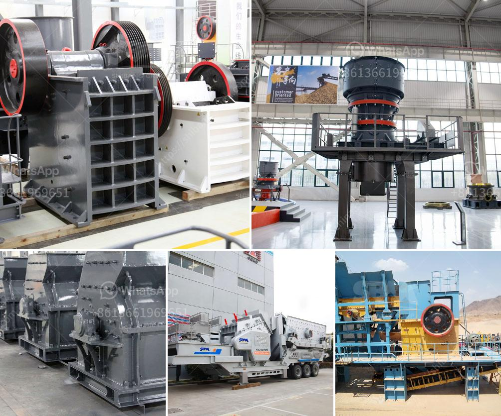

<h3>screener crusher china</h3>
Screener crushers have gained popularity in recent years as versatile tools in China's construction and mining industries. These machines combine the functions of a screener and a crusher, making them a cost-effective and efficient solution for crushing and separating materials on site. With their high productivity and compact design, screener crushers have become a preferred choice for contractors and project managers across the country.

One of the major advantages of screener crushers is their ability to process a wide range of materials, including soils, rocks, concrete, and asphalt. This versatility eliminates the need for multiple machines, reducing both costs and the carbon footprint associated with transportation. Additionally, the ability to crush and screen materials on site reduces the need for manual labor and machinery, further boosting efficiency and productivity.

China's construction sector is experiencing rapid growth, with numerous infrastructure projects underway. The demand for construction materials, such as aggregates and concrete, is surging. Screener crushers play a crucial role in this industry by quickly and efficiently processing these materials. The all-in-one design of these machines facilitates continuous production, reducing downtime and maximizing output. The ability to produce multiple sizes of high-quality aggregate on site reduces reliance on external suppliers and ensures the availability of materials to keep up with construction timelines.

In the mining industry, screener crushers are used for extracting valuable minerals from excavated earth or ore deposits. These machines help reduce the need for manual sorting and sieving, maximizing the efficiency of mining operations. Additionally, the ability to crush and screen materials on site helps extract the most valuable minerals while minimizing waste and environmental impact.

China's emphasis on environmental sustainability and eco-friendly practices further adds to the appeal of screener crushers. These machines reduce the volume of waste generated and allow for easy recycling of materials. This not only helps preserve natural resources but also reduces the need for landfill space and cuts down on transportation costs associated with waste disposal.

In recent years, Chinese manufacturers have made significant advancements in screener crusher technology. They have developed machines that feature robust construction, advanced screening techniques, and high-quality crushing capabilities. These machines are designed to withstand the harsh conditions of construction and mining sites, ensuring their durability and longevity.

Furthermore, Chinese manufacturers offer a wide range of screener crusher models to cater to different requirements. From compact machines suitable for urban demolition projects to larger models intended for heavy-duty mining operations, there is a screener crusher suitable for every application in China's diverse industries.

In conclusion, screener crushers have emerged as essential tools in China's construction and mining industries due to their versatility, efficiency, and sustainability. With their ability to process various materials on site and produce high-quality aggregate, these machines contribute to the timely completion of construction projects and the optimization of mining operations. Chinese manufacturers continue to push the boundaries of screener crusher technology, offering innovative solutions that meet the evolving needs of the industry. As China's construction and mining sectors continue to expand, the demand for screener crushers is expected to soar, solidifying their position as indispensable machines in these industries.
<h3>Contact us</h3><ul><li><strong>Whatsapp:&nbsp;<a href="https://wa.me/8613661969651">+8613661969651</a></strong></li><li><a href="https://swt.shibang-china.com/?git&amp;zhl&amp;screener crusher china"><strong>Online Service(chat now)</strong></a></li></ul><h3>Related</h3><ul><li><a href='complete new stone crusher plant in south africa.md'>complete new stone crusher plant in south africa</a></li><li><a href='coal grinding mill in bhopal india.md'>coal grinding mill in bhopal india</a></li><li><a href='price of stone crusher in philippines.md'>price of stone crusher in philippines</a></li><li><a href='small ball mill for sale.md'>small ball mill for sale</a></li><li><a href='copper mining companies in congo.md'>copper mining companies in congo</a></li></ul>