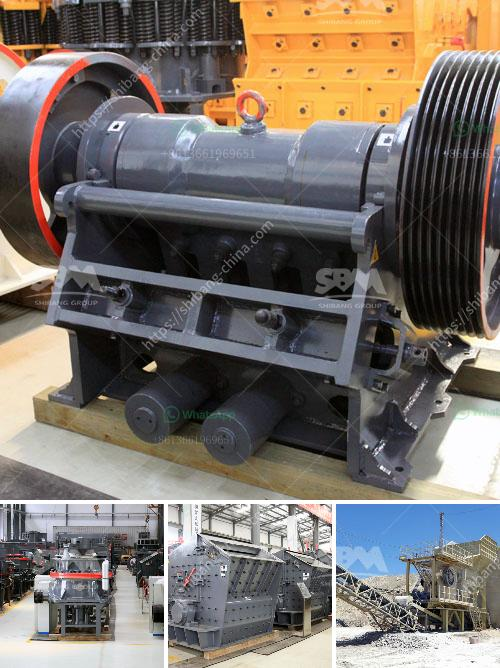

<h3>screening and wash plant manufacturers in south africa</h3>
South Africa is one of the largest mining and minerals processing countries in the world. With its ample resources and vast reserves, it plays a crucial role in the global mining industry. Screening and wash plants are integral to the extraction and processing of minerals, and South Africa has a wealth of manufacturers to choose from for those looking to incorporate these plants into their operations.

When it comes to screening and wash plant manufacturers, South Africa offers a diverse range of options. From large-scale manufacturers with international recognition to smaller, local businesses, there is a solution to suit every need and budget.

One of the key players in the industry is Osborn, a South African company that has been manufacturing crushing and screening equipment for over a century. Osborn has a wide range of plants suited for various applications, including modular plants that can be easily transported and installed on-site. Their products are known for their quality, durability, and reliability, making them a popular choice among mining companies both in South Africa and abroad.

Another notable manufacturer in South Africa is Pilot Crushtec. With a focus on mobile and semi-mobile crushing, screening, and material handling solutions, they provide a comprehensive range of equipment for various mining applications. Their products are designed to increase productivity and efficiency while minimizing downtime and maintenance costs.

Multotec is another prominent player in the screening and wash plant manufacturing industry in South Africa. With over 45 years of experience, Multotec specializes in the design and supply of customized solutions for mineral processing plants. Their products are known for their high-quality materials, innovative design, and superior performance.

In addition to the above-mentioned manufacturers, South Africa is also home to several other companies that specialize in screening and wash plant manufacturing. These include companies like Telsmith, IMS Engineering, and Bell Equipment. Each of these manufacturers offers a unique range of products and services, catering to different demands and requirements.

Aside from the wide selection of manufacturers available in South Africa, there are other advantages to sourcing screening and wash plants locally. Local manufacturers have a deep understanding of the local conditions, regulations, and challenges faced by mining companies in the country. This allows them to provide customized solutions specifically tailored to the unique needs of South African mining operations.

Furthermore, by supporting local manufacturers, mining companies can contribute to the growth and development of the South African economy. These manufacturers not only provide direct employment but also contribute to the development of local skills and expertise in the industry.

In conclusion, South Africa offers a diverse range of screening and wash plant manufacturers for the mining industry. From large-scale international players to smaller local businesses, there is a solution to suit every need and budget. Supporting these manufacturers not only ensures access to high-quality products but also contributes to the growth and development of the South African mining sector.
<h3>Contact us</h3><ul><li><strong>Whatsapp:&nbsp;<a href="https://wa.me/8613661969651">+8613661969651</a></strong></li><li><a href="https://swt.shibang-china.com/?git&amp;zhl&amp;screening and wash plant manufacturers in south africa"><strong>Online Service(chat now)</strong></a></li></ul><h3>Related</h3><ul><li><a href='concrete stone crusher south africa.md'>concrete stone crusher south africa</a></li><li><a href='checklist for heavy stone crusher machine.md'>checklist for heavy stone crusher machine</a></li><li><a href='slag grinding plant.md'>slag grinding plant</a></li><li><a href='stone crusher machine size 100 x 100 cm.md'>stone crusher machine size 100 x 100 cm</a></li><li><a href='calcium ball mill.md'>calcium ball mill</a></li></ul>