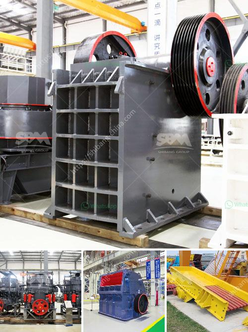

<h3>self healing process of limestone</h3>
Limestone, a widely used sedimentary rock, boasts a unique and natural ability to self-heal. The process of self-healing in limestone is an incredible example of nature's intricate mechanisms. Understanding this process not only helps in preserving the integrity of limestone structures but also inspires breakthroughs in engineering, construction, and even medicine. In this article, we will delve into the fascinating world of limestone self-healing and explore its potential applications.

Limestone, composed mainly of calcium carbonate, exhibits the ability to self-heal through a process called autogenous or autonomous healing. Even when cracks or fractures occur within the rock, the mineral matrix of the limestone possesses extraordinary self-repairing properties. These properties ensure that the structural integrity of limestone is maintained over extended periods.

Self-healing in limestone occurs through the common precipitation of calcium carbonate on the exposed surfaces of the fractures. This precipitation comes from solutions either seeping through the rock or present in the surrounding environment. Over time, the newly formed carbonate minerals within the fractures increase in density, filling the gaps and effectively restoring the rock to its original state.

Several factors play a crucial role in the success of limestone's self-healing process. Firstly, the availability of dissolved calcium carbonate in the surrounding environment is vital for the growth and formation of new minerals. Factors such as temperature, pH, and the concentration of ions in the water greatly influence the rate and effectiveness of self-healing.

Moreover, the size and width of the cracks significantly impact the speed of self-repair. Smaller cracks have a higher likelihood of being healed, as the precipitation process can effectively bridge the gaps, while larger fractures might require external assistance or intervention to heal effectively.

The self-healing properties of limestone have the potential to revolutionize various fields. In the realm of engineering and construction, this exceptional ability can contribute to the development of more durable and sustainable materials. Self-healing limestone could be incorporated into building materials, reducing the need for constant maintenance and repair, thus reducing costs and environmental impact.

Furthermore, studying the self-healing mechanism of limestone can provide insights into medical and pharmaceutical arenas. The principles behind self-healing limestone could inform the development of biomaterials capable of repairing bones, teeth, and other biological structures. This newfound understanding could expedite the healing process, alleviate the need for complex surgeries, and foster advancements in regenerative medicine.

Limestone's self-healing process exemplifies nature's ability to repair and restore itself. By unraveling the intricate mechanisms behind this phenomenon, we unlock a wealth of possibilities for material applications and medical advancements. Embracing this remarkable quality of limestone could be the first step towards a future of sustainable and self-repairing structures.
<h3>Contact us</h3><ul><li><strong>Whatsapp:&nbsp;<a href="https://wa.me/8613661969651">+8613661969651</a></strong></li><li><a href="https://swt.shibang-china.com/?git&amp;zhl&amp;self healing process of limestone"><strong>Online Service(chat now)</strong></a></li></ul><h3>Related</h3><ul><li><a href='nigeria quartz plant in kenya.md'>nigeria quartz plant in kenya</a></li><li><a href='harga mesin ball mill.md'>harga mesin ball mill</a></li><li><a href='double toggle jaw crushers.md'>double toggle jaw crushers</a></li><li><a href='europe crusher producers.md'>europe crusher producers</a></li><li><a href='300tph mobile crushing plant.md'>300tph mobile crushing plant</a></li></ul>