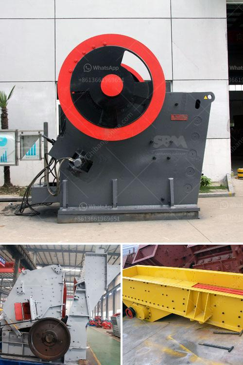

<h3>sell conveyor belts in south africa</h3>
South Africa is a vibrant nation with a rich history, diverse culture, and a booming economy. Industries such as mining, manufacturing, agriculture, and logistics form the backbone of the country's economy, contributing significantly to its growth and development. One essential component that aids in achieving efficiency and productivity in these industries is the conveyor belt.

Conveyor belts are an integral part of a wide range of industries as they provide an efficient and reliable method for transporting bulk materials, goods, and products from one point to another. These belts are flexible and can be customized to suit various applications, making them indispensable in South Africa's industrial landscape.

The mining industry in South Africa is one of the largest contributors to the country's GDP. Conveyor belts play a crucial role in the mining process by transporting coal, iron ore, precious minerals, and other materials from the mines to the processing plants or stockyards. With their ability to withstand heavy loads and long-distance travel, conveyor belts ensure a steady flow of materials, improving operational efficiency and reducing manual labor.

In the manufacturing sector, conveyor belts are used to automate production lines, significantly increasing productivity. They enable the seamless movement of raw materials, work-in-progress items, and finished goods within factories, ensuring smooth operations and timely delivery. Additionally, conveyor belts offer flexibility in terms of design, allowing manufacturers to optimize their production processes and adapt to specific requirements.

The agricultural industry also benefits from conveyor belts, particularly in large-scale farming operations. These belts are used to transport harvested crops, such as wheat, corn, and sugar cane, from the fields to storage areas or processing facilities. By automating the transportation process, farmers can save time and effort, enabling them to focus on other critical tasks.

The logistics industry heavily relies on conveyor belts to facilitate the smooth movement of goods and products in warehouses, distribution centers, and airports. Sorting and distribution centers often use conveyor belts equipped with barcode scanners and automated systems, ensuring accurate and efficient movement of packages. These belts streamline the order fulfillment process, improve inventory management, and expedite the delivery of goods.

When it comes to selling conveyor belts in South Africa, it is essential to ensure high-quality products that meet industry standards and regulations. Conveyor belts must be durable, resistant to wear and tear, and capable of handling heavy loads. They should also be customizable to suit specific applications and provide optimal performance in varying environmental conditions.

To effectively market conveyor belts in South Africa, suppliers and manufacturers need to establish strong relationships with industries that rely on these belts. Understanding the unique requirements of different sectors and offering tailored solutions is crucial. Additionally, providing after-sales service, maintenance, and technical support is essential for building trust and ensuring customer satisfaction.

In conclusion, conveyor belts are an integral part of South Africa's industries, providing efficiency, productivity, and enhanced automation. Their versatility and ability to handle heavy loads make them indispensable in sectors such as mining, manufacturing, agriculture, and logistics. By offering high-quality, customizable products and establishing strong relationships with industry players, suppliers and manufacturers can successfully sell conveyor belts in South Africa, contributing to the nation's economic growth and development.
<h3>Contact us</h3><ul><li><strong>Whatsapp:&nbsp;<a href="https://wa.me/8613661969651">+8613661969651</a></strong></li><li><a href="https://swt.shibang-china.com/?git&amp;zhl&amp;sell conveyor belts in south africa"><strong>Online Service(chat now)</strong></a></li></ul><h3>Related</h3><ul><li><a href='sell jaw crusher.md'>sell jaw crusher</a></li><li><a href='floating processing mining plants.md'>floating processing mining plants</a></li><li><a href='cement process making in philippines.md'>cement process making in philippines</a></li><li><a href='rock crusher price.md'>rock crusher price</a></li><li><a href='list of quarry operators in uae.md'>list of quarry operators in uae</a></li></ul>