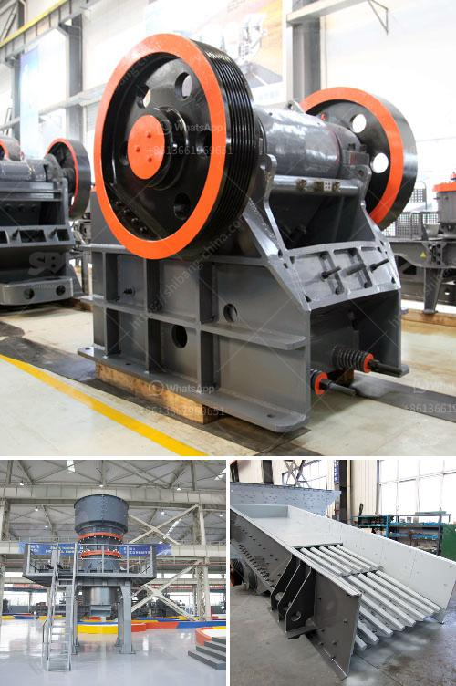

<h3>sell crusher conica peru</h3>
Peru, a rapidly developing country in South America, is witnessing a surge in construction projects. As these projects increase in scale and complexity, the demand for advanced machinery also rises. One of the key players in the construction machinery market is the crusher conica, a type of cone crusher specifically designed for crushing construction materials. Today, we will explore how Peru is embracing this revolutionary equipment and the benefits it offers to the construction industry.

The crusher conica is a versatile machine that plays a crucial role in the construction process. It breaks down rocks, minerals, and other materials into smaller, manageable pieces, which can then be used as the foundation for infrastructure projects. These crushers are known for their high productivity, reliability, and low operating costs, making them an ideal choice for businesses looking to increase efficiency and profitability.

Peru, a country famous for its rich natural resources, has a high demand for crushers conica to extract and process minerals like copper, gold, and silver. Extractive industries are a vital part of Peru's economy, contributing to its GDP and creating job opportunities for thousands of people. The use of crusher conica helps streamline the mineral extraction process, resulting in higher productivity and reduced costs.

The construction industry in Peru is also experiencing a boom, with several infrastructure projects underway to accommodate the growing population and boost economic growth. These projects include the construction of highways, bridges, airports, and housing, among others. The crusher conica is an essential tool for crushing materials like concrete, gravel, and stones, which are fundamental components in these construction projects. Its ability to produce consistent and high-quality crushed materials ensures the durability and strength of the built structures.

One of the leading companies in the crusher conica market is XYZ Machinery. They have a strong presence in Peru, providing top-of-the-line equipment and excellent customer service. XYZ Machinery's crusher conica boasts cutting-edge technology, including an intelligent control system that automatically adjusts the crusher settings, maximizing productivity and reducing downtime. Furthermore, their machines are designed to be eco-friendly, minimizing environmental impact.

The benefits of using crusher conica in Peru's construction industry extend beyond efficiency and profitability. By investing in this advanced machinery, contractors and businesses can ensure worker safety by minimizing manual handling of heavy materials. Additionally, crusher conica reduces the need for manual labor, allowing workers to focus on other crucial tasks, increasing productivity, and reducing fatigue-related injuries.

Moreover, the crusher conica market in Peru provides ample opportunities for job creation and economic growth. As more companies invest in this machinery, it creates a demand for skilled workers, engineers, and technicians who can operate, maintain, and repair the equipment. This helps stimulate the local economy and promotes technological advancements within the construction industry.

In conclusion, Peru's construction industry is embracing the use of crusher conica to revolutionize the way construction materials are extracted and processed. The crusher conica offers numerous benefits, such as increased productivity, reliability, and reduced operating costs. Moreover, its eco-friendly features and contribution to worker safety make it an ideal choice for businesses operating in Peru. As the country continues to witness massive infrastructure development, the market for crusher conica is expected to grow, fostering job creation and economic prosperity.
<h3>Contact us</h3><ul><li><strong>Whatsapp:&nbsp;<a href="https://wa.me/8613661969651">+8613661969651</a></strong></li><li><a href="https://swt.shibang-china.com/?git&amp;zhl&amp;sell crusher conica peru"><strong>Online Service(chat now)</strong></a></li></ul><h3>Related</h3><ul><li><a href='crushing machine manufacturers.md'>crushing machine manufacturers</a></li><li><a href='grinding machine project report.md'>grinding machine project report</a></li><li><a href='ball mill pulverizer.md'>ball mill pulverizer</a></li><li><a href='stone crushing plant manufacturers in.md'>stone crushing plant manufacturers in</a></li><li><a href='stone crusher plant south africa.md'>stone crusher plant south africa</a></li></ul>