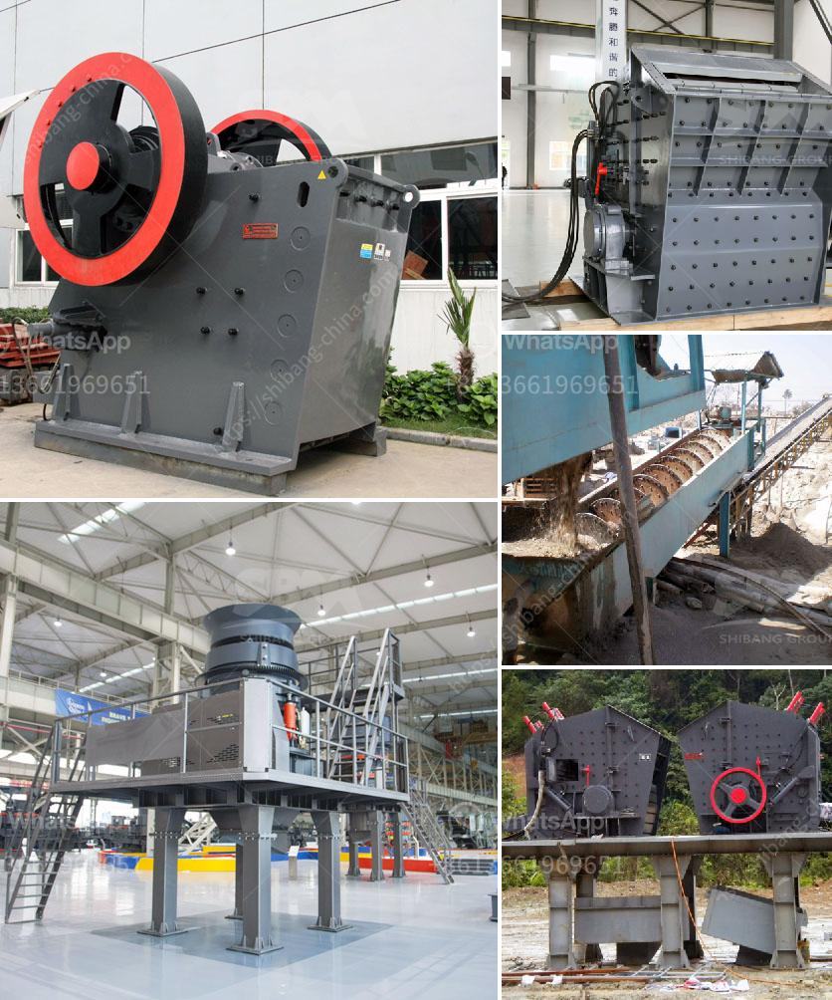

<h3>sell jaw crusher</h3>
In the modern era, the construction industry is thriving on the back of increasing demand for infrastructure projects, utilizing cutting-edge machinery to sustain its growth. The jaw crusher has become an essential piece of equipment in construction and mining projects due to its ability to crush materials of any hardness. With the emergence of jaw crushers, mining and construction industries have seen a substantial increase in efficiency and productivity.

A jaw crusher is a machine that breaks building materials such as rocks, mountains into small pieces. Larger rock pieces can be reduced into smaller pieces such as gravel, sand, or rock dust. In the construction and mining industry, a jaw crusher is a machine used to crush blocks of mineral materials into smaller pieces. The large rocks are first crushed into smaller pieces using a jaw crusher, and then further reduced to gravel-sized particles using conveyors, vibrating screens, and other equipment.

The primary use of jaw crushers in construction and mining industries is to break large materials into smaller pieces, making them suitable for further processing and use in other construction and mining applications. Jaw crushers are widely used in the construction and mining industry due to their ability to handle large quantities of material and reduce it to smaller sized particles.

The demand for jaw crushers in the construction and mining industry is growing at an exponential rate, as it is the most used crushing equipment across various industries. Be it road construction, mining, building, or any other construction aggregate needs, jaw crushers are the primary choice for crushing.

When it comes to selling a jaw crusher, there are a few things to consider. First and foremost, ensure that the product you are selling is of high quality and meets the industry standards. Customers in the construction and mining industry expect reliable and efficient equipment that can sustain heavy-duty operations.

To successfully sell a jaw crusher, it is crucial to highlight its features and benefits. For instance, emphasize on the durability of the machine, its ease of maintenance, and the availability of spare parts. Customers are more likely to invest in a jaw crusher that promises long-term usage without the hassle of frequent repairs or replacements.

Additionally, providing comprehensive after-sales service is essential. Customers value prompt responses and assistance when it comes to maintenance, repairs, or spare parts replacement.

Furthermore, marketing strategies play a significant role in selling jaw crushers. Utilize various platforms, such as online advertising, social media, and industry events, to showcase the advantages of your jaw crusher. A well-designed website that provides detailed product specifications and testimonials from satisfied customers can be instrumental in attracting potential buyers.

Lastly, pricing plays a significant role in selling any product. Ensure that the price of your jaw crusher is competitive compared to other similar products available in the market. However, it is important to strike a balance between affordable pricing and maintaining profit margins.

In conclusion, jaw crushers have become a cornerstone in the construction and mining industry due to their efficiency and ability to break down large materials into smaller, more manageable pieces. When selling a jaw crusher, it is crucial to emphasize its quality, durability, and after-sales service. Utilize marketing strategies to highlight its advantages, and price it competitively. With the right approach, selling a jaw crusher can be a profitable venture in the construction and mining industry.
<h3>Contact us</h3><ul><li><strong>Whatsapp:&nbsp;<a href="https://wa.me/8613661969651">+8613661969651</a></strong></li><li><a href="https://swt.shibang-china.com/?git&amp;zhl&amp;sell jaw crusher"><strong>Online Service(chat now)</strong></a></li></ul><h3>Related</h3><ul><li><a href='clay crusher machine in india.md'>clay crusher machine in india</a></li><li><a href='washing plant suppliers in mozambique.md'>washing plant suppliers in mozambique</a></li><li><a href='lates hammer mill.md'>lates hammer mill</a></li><li><a href='ballast machines for sale in kenya.md'>ballast machines for sale in kenya</a></li><li><a href='gypsum powder production process pdf.md'>gypsum powder production process pdf</a></li></ul>