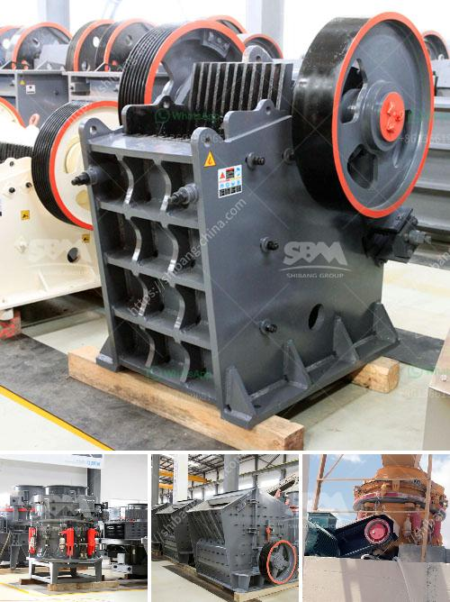

<h3>sell of used dolomite roller mill in india</h3>
The sale of used Dolomite roller mills in India is gaining momentum in recent years. With the rapid development of the Indian economy, the demand for cement and other construction materials has increased significantly. This has led to a surge in the production of these materials, consequently driving the demand for Dolomite roller mills.

Dolomite is a natural mineral consisting of calcium magnesium carbonate. It is widely used in the manufacturing of cement, as a flux in the production of iron and steel, and in agricultural applications as a soil conditioner. One of the vital steps in the production of Dolomite is milling, where the raw mineral is ground into a fine powder that can be used in various industries.

Due to the high cost of acquiring new Dolomite roller mills, many companies in India opt to purchase used ones instead. These used mills offer a cost-effective solution without compromising on quality. Furthermore, the availability of used Dolomite roller mills in India ensures a quick turnaround time for companies to meet their production demands.

The used Dolomite roller mills in India are primarily sourced from industries that have upgraded their machinery and are looking to sell their old equipment. These mills undergo a stringent refurbishment process, ensuring they are in good working condition before being sold in the market. This refurbishment process includes replacing any worn-out or damaged parts, cleaning and lubricating the machines, and conducting thorough quality checks.

The sale of used Dolomite roller mills in India provides a win-win situation for both the seller and the buyer. The seller can recover a significant portion of their initial investment by selling the used equipment, while the buyer can acquire a well-maintained Dolomite roller mill at a fraction of the cost of a new one. This cost advantage allows companies to allocate their resources more efficiently, thereby enabling them to invest in other areas of their business.

In addition to cost savings, the sale of used Dolomite roller mills in India also contributes to sustainable practices. By reusing equipment instead of discarding it, environmental impact is reduced. Moreover, the production of new machinery involves extensive mining and manufacturing processes, leading to significant carbon emissions. Opting for used equipment helps minimize the carbon footprint associated with the manufacture of new machinery.

To sum up, the sale of used Dolomite roller mills in India has gained traction due to their cost-effectiveness and contribution to sustainable practices. The demand for these mills is fueled by the increasing need for cement and other construction materials. The availability of refurbished equipment offers companies a reliable and economical solution, allowing them to meet their production requirements without breaking the bank. As India continues to witness rapid industrial growth, the sale of used Dolomite roller mills is expected to flourish, benefiting both businesses and the environment.
<h3>Contact us</h3><ul><li><strong>Whatsapp:&nbsp;<a href="https://wa.me/8613661969651">+8613661969651</a></strong></li><li><a href="https://swt.shibang-china.com/?git&amp;zhl&amp;sell of used dolomite roller mill in india"><strong>Online Service(chat now)</strong></a></li></ul><h3>Related</h3><ul><li><a href='stone crusher portable.md'>stone crusher portable</a></li><li><a href='bauxite ore processing plant for sale.md'>bauxite ore processing plant for sale</a></li><li><a href='machinery conveyor belts.md'>machinery conveyor belts</a></li><li><a href='crusher 40 ton per jam.md'>crusher 40 ton per jam</a></li><li><a href='proposal pabrik stone crusher.md'>proposal pabrik stone crusher</a></li></ul>