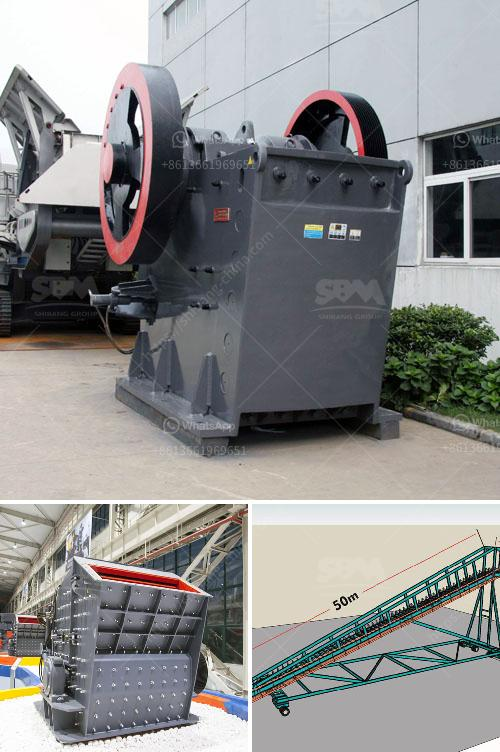

<h3>sell stone crusher crushing plant feeder screen conveyors</h3>
When it comes to selling stone crushers, crushing plants, feeder, screen, conveyors, and other heavy machinery, we delve into the plethora of opportunities in the construction and mining industry. Selling these types of equipment has always been a lucrative business, especially in recent years due to the rapid growth of infrastructure projects.

Stone crushers play an important role in the production of aggregates, which are raw materials used in various construction projects such as roads, highways, buildings, bridges, and more. A crushing plant consists of a variety of machines, such as jaw crushers, impact crushers, cone crushers, and screens, which are all used to process raw materials.

Feeder systems are an essential part of any crushing plant as they help regulate the flow of materials into the crushers. Efficient feeders ensure that the crushers run smoothly without any interruptions or delays, thereby enhancing overall productivity.

Screens are critical components of crushing plants as they separate the crushed materials into different sizes. They are essential for producing graded aggregates that meet the required specifications for different applications.

Conveyors are an integral part of the entire crushing plant setup. They transport materials from one stage to another, ensuring a smooth and continuous flow of operations. Conveyors also contribute to reducing labor costs and increasing efficiency in material handling.

As a manufacturer or supplier of stone crushing plants, feeder systems, screens, and conveyors, it is crucial to understand the market demand and cater to it effectively. The growing demand for infrastructure projects across the globe provides an excellent opportunity for businesses involved in this sector to capitalize on the market potential.

Marketing strategies such as advertising in relevant trade magazines, participating in trade shows and exhibitions, and leveraging the power of online platforms can help reach potential customers. Building and maintaining strong relationships with contractors, builders, and project developers can also lead to recurring sales and long-term partnerships.

Furthermore, emphasizing the quality and reliability of the machinery offered can be a key factor in attracting customers. Providing after-sales support, warranty options, and technical assistance can go a long way in building and maintaining a loyal customer base.

In conclusion, selling stone crushers, crushing plants, feeder systems, screens, and conveyors presents a lucrative business opportunity in the construction and mining industry. With the growing demand for infrastructure projects worldwide, there is a significant market potential for manufacturers and suppliers of these heavy machinery. By adopting effective marketing strategies, focusing on quality, and providing reliable after-sales support, businesses can thrive in this competitive market.
<h3>Contact us</h3><ul><li><strong>Whatsapp:&nbsp;<a href="https://wa.me/8613661969651">+8613661969651</a></strong></li><li><a href="https://swt.shibang-china.com/?git&amp;zhl&amp;sell stone crusher crushing plant feeder screen conveyors"><strong>Online Service(chat now)</strong></a></li></ul><h3>Related</h3><ul><li><a href='market analysis of stone crusher.md'>market analysis of stone crusher</a></li><li><a href='principle of cone crusher.md'>principle of cone crusher</a></li><li><a href='mobile chrome crusher suppliers in south africa.md'>mobile chrome crusher suppliers in south africa</a></li><li><a href='mining crusher costs.md'>mining crusher costs</a></li><li><a href='pulveriser machine new technolgy.md'>pulveriser machine new technolgy</a></li></ul>